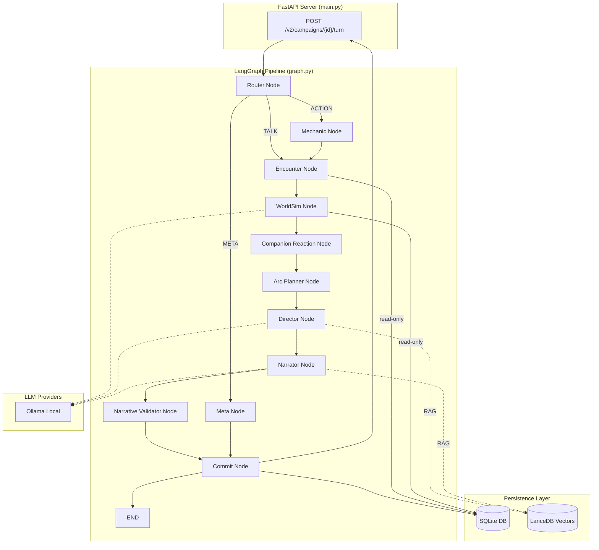

# 00 — System Overview

## What the System Does

Storyteller AI V2.15 ("Living World") is a text-based RPG engine that runs a turn-by-turn narrative loop driven by a **LangGraph state-machine pipeline**. A player selects from KOTOR-style dialogue-wheel suggestions; the engine classifies the input, resolves mechanics, simulates off-screen world events, generates dramatic pacing instructions, and produces final prose narration — all in a single turn.

The "Living World" mechanic is the core differentiator: every player action costs in-game time (in minutes). When accumulated time crosses a configurable tick boundary (default 4 hours), a **WorldSim** node fires an LLM-driven faction simulation that moves NPC factions, generates rumors, and feeds a Mass Effect-style news briefing system — making the world feel alive even when the player isn't directly interacting with those factions.

## Key Design Principles

| Principle | Implementation |
| ----------- | --------------- |
| **Local-First** | Default provider is Ollama (local LLMs). No cloud dependency required. |
| **Single Transaction Boundary** | Only `CommitNode` (the last pipeline node) writes to the database. All preceding nodes are pure functions that pass state forward. This prevents partial-write corruption. |
| **Deterministic Mechanic** | The `MechanicAgent` uses zero LLM calls. All dice rolls, DC computation, time costs, and event generation are pure Python. This guarantees reproducible gameplay mechanics regardless of model quality. |
| **Deterministic Suggestions** | Suggestions are 100% deterministic (no LLM). `generate_suggestions()` in `director_validation.py` produces exactly 4 KOTOR-style options based on game state, mechanic results, present NPCs, and scene context. |
| **Event Sourcing** | The source of truth is an append-only event log (`turn_events` table). Normalized tables (`characters`, `inventory`, `campaigns.world_state_json`) are projections derived from events via `apply_projection()`. |
| **Per-Role LLM Config** | Agent configuration is per-role via environment variables (`STORYTELLER_{ROLE}_MODEL`). Multi-model: `mistral-nemo:latest` for Director/Narrator, `qwen3:4b` for lightweight roles (Architect, Casting, Biographer, KG). |
| **Graceful Degradation** | Every LLM-dependent agent has a deterministic fallback. If the LLM is down or returns garbage, the game continues with safe defaults. |
| **Prose-Only Narrator** | The Narrator writes only prose (5-8 sentences, max 250 words). Suggestions are never embedded in narration. Post-processing strips structural artifacts and enforces word-count limits. |
| **Psychology System** | Each player character has a `psych_profile` (current_mood, stress_level, active_trauma) that influences narration tone, Director suggestions, and companion reactions. |
| **Tone System** | KOTOR-inspired 4-tone dialogue wheel: PARAGON (blue), INVESTIGATE (gold), RENEGADE (red), NEUTRAL (gray). `ensure_tone_diversity()` guarantees all tones are represented. |
| **3-Tier Risk** | Actions are classified as SAFE, RISKY, or DANGEROUS. Risk level affects DC modifiers, stress delta, and narration intensity. |
| **Warnings Propagation** | Turn-level warnings are collected across all pipeline nodes via `add_warning()` and surfaced in the API response and debug output. |

## Feature Highlights

| Feature | Details |
| --------- | --------- |
| **Gender/Pronoun System** | Male/female selection with pronoun injection into Director + Narrator prompts (`backend/app/core/pronouns.py`). |
| **4-Lane Style RAG** | Layered style retrieval: Base Star Wars (always-on) + Era + Genre + Archetype lanes via `retrieve_style_layered()`. |
| **Companion System** | 108 YAML-defined companions with species, voice_tags, motivation, speech_quirk. 17 banter styles. Inter-party tensions via `compute_inter_party_tensions()`. Companion-initiated events at loyalty thresholds. |
| **Hero's Journey Arc Planner** | Deterministic arc planner with 12 Hero's Journey beats. Stages: SETUP, RISING, CLIMAX, RESOLUTION. `weighted_thread_count()` for semantic thread weighting. |
| **Genre Triggers** | 11 genre types activated by keyword matching. Influences style retrieval and Director pacing instructions. |
| **Era Transitions** | REBELLION, NEW_REPUBLIC, NEW_JEDI_ORDER, LEGACY era detection with transition events and era summaries. |
| **Episodic Memory** | Compressed narrative memories stored in `episodic_memories` table. Retrieved for Director/Narrator context grounding. |
| **Starship Acquisition** | No starting ships; earned in-story via quest/purchase/salvage/faction/theft. `STARSHIP_ACQUIRED` event handler. No ship = NPC transport. |
| **Personality Profiles** | NPC characterization via personality profile blocks injected into Director/Narrator prompts. |
| **Deterministic Faction Engine** | No LLM calls. Faction reputation tracking, NPC movement (20% chance per tick), faction-aware goals in `npc_states`. |
| **Knowledge Graph** | Optional KG extraction from lore. Entity resolution, triple store, synthesis summaries for runtime retrieval. |

## High-Level Architecture



## Quickstart

### Prerequisites

- Python 3.11+
- Ollama running locally (`http://localhost:11434`) with models pulled:
  - `ollama pull mistral-nemo` (Director/Narrator — quality-critical roles)
  - `ollama pull qwen3:4b` (Architect, Casting, Biographer, KG — lightweight roles)
  - `ollama pull nomic-embed-text` (embedding)
- Embeddings default to `sentence-transformers/all-MiniLM-L6-v2` (downloads automatically on first ingest/retrieval)

### Start the stack (recommended)

**Windows (fastest):**

```powershell
.\setup_dev.bat
.\start_dev.bat
```

**Cross-platform:**

```bash
python -m venv venv
# Activate venv, then:

pip install -e .
python -m storyteller setup
python -m storyteller dev
```

### Create a Campaign & Play

```bash
# Auto-setup (LLM generates campaign skeleton + character sheet)

curl -X POST http://localhost:8000/v2/setup/auto \
  -H "Content-Type: application/json" \
  -d '{"player_concept": "A bounty hunter in a cyberpunk city"}'

# Run a turn

curl -X POST "http://localhost:8000/v2/campaigns/{campaign_id}/turn?player_id={player_id}" \
  -H "Content-Type: application/json" \
  -d '{"user_input": "I search the back alley for clues"}'
```

## Tech Stack Summary

| Component | Technology |
| ----------- | ----------- |
| Language | Python 3.11 |
| Web Framework | FastAPI + Uvicorn |
| Pipeline Orchestration | LangGraph (StateGraph) |
| Data Validation | Pydantic V2 |
| Primary DB | SQLite (event sourcing + projections) |
| Vector DB | LanceDB (RAG retrieval) |
| Embeddings | `sentence-transformers/all-MiniLM-L6-v2` (384-dim, swappable via `EMBEDDING_MODEL` env) |
| Default LLM | Ollama (local; multi-model: `mistral-nemo:latest` for Director/Narrator, `qwen3:4b` for Architect/Casting/Biographer/KG, `qwen3:8b` for Mechanic/Ingestion, `nomic-embed-text` for embedding) |
| Frontend | SvelteKit (`frontend/`) |
| Tests | 467+ passing (`pytest`) |

For model/provider overrides, cloud/local/hybrid decisions, and campaign timeline planning, see: `docs/10_model_selection_and_timeline.md`.
