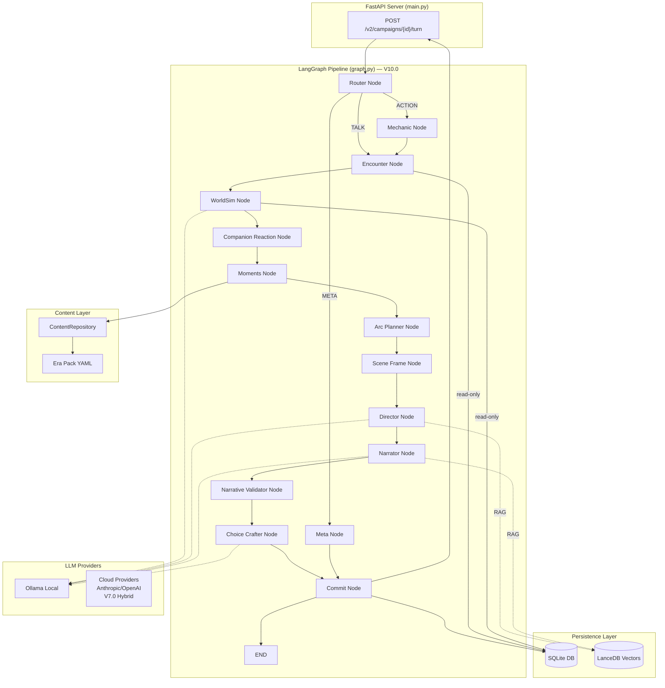

# 00 — System Overview

## What the System Does

Storyteller AI (current codebase, project version 0.1.0, engine version V11.0) is a text-based RPG engine that runs a turn-by-turn narrative loop driven by a **LangGraph state-machine pipeline**. A player selects from KOTOR-style dialogue-wheel choices; the engine classifies the input, resolves mechanics, fires any scripted narrative moments, simulates off-screen world events, generates dramatic pacing instructions, and produces final prose narration — all in a single turn.

The "Living World" mechanic is the core differentiator: every player action costs in-game time (in minutes). When accumulated time crosses a configurable tick boundary (default 4 hours), a **WorldSim** node fires a deterministic faction simulation (with optional LLM-driven world narrative) that moves NPC factions, generates rumors, and feeds a Mass Effect-style news briefing system — making the world feel alive even when the player isn't directly interacting with those factions.

**V5.0 introduced setting-agnostic architecture; V7.0 adds production-readiness; V8.0 adds multi-arc campaigns; V9.0 adds novel-length storytelling; V10.0 adds narrative intelligence; V11.0 adds player experience UX.** Agents no longer hardcode universe names, species, or factions. All setting-specific content comes from `SettingRules` (stored in `world_state_json["setting_rules"]`) and era pack YAML files, loaded via the `ContentRepository` singleton. V10.0 adds dramatic irony, creative input detection, narrative rhythm hints, revelation timing, callback crystallization, player behavioral profiling, foreshadowing hooks, thematic resonance across arcs, arc mood profiles, and companion wound/reveal layers. V11.0 adds Universe & Story UX (frontend), UI-exposed lore source management, and optional portrait/key art serving (feature-flagged).

## Key Design Principles

| Principle | Implementation |
| ----------- | --------------- |
| **Local-First** | Default provider is Ollama (local LLMs). No cloud dependency required. |
| **Single Transaction Boundary** | Only `CommitNode` (the last pipeline node) writes to the database. All preceding nodes are pure functions that pass state forward. This prevents partial-write corruption. |
| **Deterministic Mechanic** | The `MechanicAgent` uses zero LLM calls. All dice rolls, DC computation, time costs, and event generation are pure Python. This guarantees reproducible gameplay mechanics regardless of model quality. |
| **LLM-Driven Choices (V5.0)** | The `ChoiceCrafterNode` replaced the deterministic `SuggestionRefiner`. Player choices are now fully LLM-generated from the Narrator's prose, scene context, and arc state. This is an authoritative node — on failure it raises `AgentFailureError`, surfaced as a structured error to the player. |
| **Event Sourcing** | The source of truth is an append-only event log (`turn_events` table). Normalized tables (`characters`, `inventory`, `campaigns.world_state_json`) are projections derived from events via `apply_projection()`. |
| **Per-Role LLM Config** | Agent configuration is per-role via environment variables (`STORYTELLER_{ROLE}_MODEL`, `STORYTELLER_{ROLE}_PROVIDER`). Multi-model: `mistral-nemo:latest` for Director/Narrator, `qwen3:8b` for medium roles (ChoiceCrafter, Mechanic, CompanionSystem, WorldMind, QuestWeaver, Memory, Prologue, ArcScreenplay, Bible, EraForge), `qwen3:4b` for lightweight roles (Architect, Casting, Biographer, KG Extraction, IntentRouter, ArcWeaver, Continuity, Progression, PsychArchivist, RevelationAgent, CallbackCrystallizer). V7.0 adds per-role cloud provider routing (e.g., `anthropic` for quality-critical roles). |
| **Deferred Maintenance Agents (V7.0+)** | Heavy maintenance agents (MemoryAgent, QuestWeaver, ProgressionAgent, PsychArchivist) plus V10.0 intelligence agents (RevelationAgent, CallbackCrystallizer, PlayerProfileAgent) run post-commit via `pending_world_state_patches` table, reducing transaction hold time from 10-20s to ~2s. |
| **Shared Pipeline Executor (V7.0)** | `run_turn()` via `_run_pipeline_with_timings()` with `get_pre_narrator_steps()`/`get_post_narrator_steps()` helpers ensures streaming and non-streaming paths execute identical node sequences. |
| **SQLite WAL Mode (V7.0)** | `PRAGMA journal_mode=WAL` + `PRAGMA busy_timeout=5000` enabled in `backend/app/db/connection.py` for concurrent read safety. |
| **Graceful Degradation (non-authoritative)** | Non-authoritative pipeline nodes (Mechanic, WorldSim, Companion, Arc Planner, etc.) have deterministic fallbacks and never halt the turn. Authoritative LLM nodes (Narrator, ChoiceCrafter) raise `AgentFailureError` on failure, caught at the graph level. |
| **Prose-Only Narrator** | The Narrator writes only prose (5-8 sentences, max 250 words). Choices are never embedded in narration. Post-processing strips structural artifacts and enforces word-count limits. |
| **Psychology System** | Each player character has a `psych_profile` (current_mood, stress_level, active_trauma) that influences narration tone, Director suggestions, and companion reactions. |
| **Tone System** | KOTOR-inspired 4-tone dialogue wheel: PARAGON (blue), INVESTIGATE (gold), RENEGADE (red), NEUTRAL (gray). `ensure_tone_diversity()` guarantees all tones are represented. |
| **3-Tier Risk** | Actions are classified as SAFE, RISKY, or DANGEROUS. Risk level affects DC modifiers, stress delta, and narration intensity. |
| **Warnings Propagation** | Turn-level warnings are collected across all pipeline nodes via `add_warning()` and surfaced in the API response and debug output. |
| **Setting-Agnostic Design** | All universe-specific content comes from era pack YAML and `SettingRules`. Agents use `get_setting_rules(state)` instead of hardcoded setting references. |

## Feature Highlights

| Feature | Details |
| --------- | --------- |
| **Gender/Pronoun System** | Male/female selection with pronoun injection into Director + Narrator prompts (`backend/app/core/pronouns.py`). |
| **4-Lane Style RAG** | Layered style retrieval: Base Star Wars (always-on) + Era + Genre + Archetype lanes via `retrieve_style_layered()`. |
| **Companion System** | 108 YAML-defined companions with species, voice_tags, motivation, speech_quirk. 17 banter styles. Inter-party tensions via `compute_inter_party_tensions()`. Companion-initiated events at loyalty thresholds. |
| **PartyState System (V5.0)** | `PartyState` model in `world_state_json["party_state"]` is the canonical companion data source. Multi-axis relationships: `influence`, `trust`, `respect`, `fear`. Backward-compatible with legacy `party_affinity` fields. |
| **Hero's Journey Arc Planner** | Deterministic arc planner with 12 Hero's Journey beats. Stages: SETUP, RISING, CLIMAX, RESOLUTION. `weighted_thread_count()` for semantic thread weighting. |
| **EraMoments System (V5.0)** | Scripted narrative moments defined in era pack YAML. Fire once on trigger (companion affinity, arc stage, turn number, location tags, quest completion, alignment). Inject `narrative_beat` into Director scene instructions. |
| **Hub/Downtime System (V5.0)** | Hub locations (cantinas, safehouses, guild halls) activate downtime mode. Hub options: rest, talk_to_companion, gather_intel, resupply, wait. Director gets hub-mode prompt injection. |
| **Quest Tracker System (V5.0)** | Deterministic quest state machine (`quest_tracker.py`). Stage-based completion with resolution paths, fail conditions, and multiple condition types. Persisted in `world_state_json["quest_log"]`. |
| **Truth Ledger (V5.0)** | SQLite-backed `truth_facts` table for persistent fact storage. `contradiction_errors()` checks claims against established facts. Distinct from the narrative `ledger.py`. |
| **Content Repository (V5.0)** | Thread-safe `ContentRepository` singleton (`backend/app/content/repository.py`) replaces direct era-pack loading. Keyed by `(setting_id, period_id)`. |
| **Genre Triggers** | 11 genre types activated by keyword matching. Influences style retrieval and Director pacing instructions. |
| **Era Transitions** | REBELLION, NEW_REPUBLIC, NEW_JEDI_ORDER, LEGACY era detection with transition events and era summaries. |
| **Episodic Memory** | Compressed narrative memories stored in `episodic_memories` table. Retrieved for Director/Narrator context grounding. |
| **Starship Acquisition** | No starting ships; earned in-story via quest/purchase/salvage/faction/theft. `STARSHIP_ACQUIRED` event handler. No ship = NPC transport. |
| **Snapshot Rewind (V7.0)** | `turn_snapshots` table stores world state per turn. `POST /campaigns/{id}/rewind?to_turn=N` atomically restores state. |
| **Canon Event Scheduler (V7.0)** | Historical mode campaigns enforce era-defined canon events via `canon_scheduler.py` with immutable truth facts. |
| **Consequence Propagation (V7.0)** | `consequence_propagator.py` with ripple/wave/tsunami impact tiers creating multi-turn follow-on effects. |
| **Schema Extraction (V7.0)** | NPC states extracted to `npc_states` table (migration 0032); quest entries to `quest_entries` table (migration 0033). |
| **Turn Idempotency (V7.0)** | `Idempotency-Key` header on turn endpoints prevents duplicate commits on retry. |
| **Saga System (V7.0)** | `sagas` + `character_legacies` tables. Campaigns grouped by player-owned saga with chapter ordering. |
| **Personality Profiles** | NPC characterization via personality profile blocks injected into Director/Narrator prompts. |
| **Deterministic Faction Engine** | No LLM calls. Faction reputation tracking, NPC movement (20% chance per tick), faction-aware goals in `npc_states`. |
| **Knowledge Graph** | Optional KG extraction from lore. Entity resolution, triple store, synthesis summaries for runtime retrieval. |
| **AgentFailureError (V5.0)** | `authoritative_call()` pattern: 2 attempts, then raises `AgentFailureError`. Caught at graph level (`run_turn()`), returns structured error in `GameState`. |
| **Multi-Arc Campaigns (V8.0)** | 2-5 arc campaigns with interlude scenes, epilogue system, cross-arc memory bridging via saga context injection. |
| **Consequence Surfacing (V8.0)** | Wave/tsunami consequence tiers surface as mandatory narrator references. Companion PRESENCE woven directive replaces appended reaction lists. |
| **Prose-Choice Bridge (V8.0)** | SCENE ENDING extraction from narrator prose feeds ChoiceCrafter for coherent choice generation. |
| **Novel-Length Storytelling (V9.0)** | Campaign settings support novel-length narrative arcs with persistent state across hundreds of turns. |
| **Dramatic Irony Tags (V10.0)** | World events hidden from the player character are surfaced to the Director as environmental hints — the reader senses danger the character doesn't. |
| **"Yes, And" Engine (V10.0)** | Creative free-text deviations from suggested choices detected via `creative_deviation` flag; Director rewards player creativity with unexpected discoveries. |
| **Narrative Rhythm Hints (V10.0)** | Prose style adapts to scene type — staccato combat, languid exploration, loaded-silence dialogue — via `NARRATIVE_RHYTHM_HINTS` constants. |
| **Revelation Agent (V10.0)** | Deferred LLM agent evaluates hidden information (NPC agendas, faction moves) and queues revelations for optimal dramatic timing via `revelation_queue`. |
| **Callback Crystallizer (V10.0)** | Deferred LLM agent identifies peak narrative moments (betrayals, sacrifices, triumphs) and stores `callback_seeds` for future echo by the Director. |
| **Player Behavioral Profiling (V10.0)** | Deterministic deferred agent analyzes choice patterns (tone distribution, risk tolerance, engagement trends) to build `player_behavior_profile` for Director guidance. |
| **Foreshadowing Hooks (V10.0)** | Arc planner seeds SETUP/RISING stages with subtle references to dangling hooks from previous arcs and hidden NPC agendas. |
| **Thematic Resonance (V10.0)** | At CLIMAX, the Director receives echoes of dominant themes from the campaign's first arc for cross-arc thematic closure. |
| **Arc Mood Profiles (V10.0)** | 5 mood profiles (heroic, noir, tragic, kishotenketsu, mystery) provide stage-specific tonal guidance to the Director. |
| **Companion Wound/Reveal Layers (V10.0)** | Companions have 3-tier psychological depth (surface/deep/core wounds) unlocked at affinity thresholds, with per-stage trigger text woven into narration. |
| **Universe & Story UX (V11.0)** | Home page "Continue Story" hero button; Universe selection as Step 0 in creation wizard; campaigns grouped by Story (saga) in load modal; last-played tracking for quick resume. Frontend-only — no pipeline changes. |
| **UI-Exposed Lore Ingestion (V11.0)** | `lore_sources` table (migration 0036) with source CRUD endpoints (`GET/POST/DELETE /v2/library/sources`); Library "Sources" tab for managing reference collections; optional "Add Reference Material" upload step in creation wizard. |
| **Optional Visual Layer (V11.0)** | `portrait_key` on `EraNpcEntry`/`EraCompanion`, `key_art` on `EraLocation`; static portrait serving at `/portraits/` when `ENABLE_PORTRAITS=1`; `portrait_url` in `PartyStatusItem` and `location_art_url` in `TurnResponse`. Default off — zero cost when disabled. |

## High-Level Architecture


```mermaid
graph TD
    subgraph "FastAPI Server (main.py)"
        API["POST /v2/campaigns/{id}/turn"]
    end

    subgraph "LangGraph Pipeline (graph.py) — V10.0"
        R[Router Node] --> | META| META[Meta Node]
        R --> | TALK| ENC[Encounter Node]
        R --> | ACTION| MECH[Mechanic Node]
        MECH --> ENC
        ENC --> WS[WorldSim Node]
        WS --> CR[Companion Reaction Node]
        CR --> MOM[Moments Node]
        MOM --> ARC[Arc Planner Node]
        ARC --> SF[Scene Frame Node]
        SF --> DIR[Director Node]
        DIR --> NAR[Narrator Node]
        NAR --> VAL[Narrative Validator Node]
        VAL --> CC[Choice Crafter Node]
        CC --> COMMIT[Commit Node]
        META --> COMMIT
        COMMIT --> END_NODE[END]
    end

    subgraph "Persistence Layer"
        SQLite[(SQLite DB)]
        LanceDB[(LanceDB Vectors)]
    end

    subgraph "LLM Providers"
        Ollama[Ollama Local]
        Cloud[Cloud Providers<br/>Anthropic/OpenAI<br/>V7.0 Hybrid]
    end

    subgraph "Content Layer"
        REPO[ContentRepository]
        EraPacks[Era Pack YAML]
    end

    API --> R
    COMMIT --> SQLite
    ENC --> | read-only| SQLite
    WS --> | read-only| SQLite
    MOM --> REPO
    REPO --> EraPacks
    DIR -.-> | RAG| LanceDB
    NAR -.-> | RAG| LanceDB
    WS -.-> Ollama
    DIR -.-> Ollama
    NAR -.-> Ollama
    CC -.-> Ollama
    COMMIT --> API
```

## Pipeline Topology (V10.0 — unchanged in V11.0)

**ACTION / TALK path:**
```
router → mechanic → encounter → world_sim → companion_reaction → moments → arc_planner → scene_frame → director → narrator → narrative_validator → choice_crafter → commit → END
```

**META path:**
```
router → meta → commit → END
```

**Key changes from previous versions:**
- `moments` node added between `companion_reaction` and `arc_planner` (EraMoment trigger system, V5.0)
- `suggestion_refiner` replaced by `choice_crafter` (authoritative LLM; no deterministic fallback, V5.0)
- `run_turn()` catches `AgentFailureError` and returns structured error in `GameState` (V5.0)
- Shared pipeline executor via `_run_pipeline_with_timings()` with `get_pre_narrator_steps()`/`get_post_narrator_steps()` helpers eliminates streaming/non-streaming path drift (V7.0)
- Deferred maintenance agents run post-commit via `pending_world_state_patches` table (V7.0)
- Turn snapshots written after each commit for rewind support (V7.0)
- Canon event checking for Historical mode campaigns (V7.0)
- Consequence propagation with ripple/wave/tsunami impact tiers (V7.0)
- Multi-arc campaigns with interlude scenes and epilogue system (V8.0)
- Novel-length storytelling with campaign settings support (V9.0)
- V10.0 narrative intelligence: 3 new deferred agents (Revelation, Callback Crystallizer, Player Profile), creative deviation detection in router, narrative rhythm hints, dramatic irony tags, foreshadowing hooks, thematic resonance, arc mood profiles, and companion wound/reveal layers — all zero-latency (deferred or prompt-only)
- V11.0 player experience: no pipeline topology changes. Universe & Story UX (frontend-only), lore source management (`lore_sources` table + API endpoints), optional portrait/key art serving (feature-flagged via `ENABLE_PORTRAITS`). New fields: `portrait_key` on NPC/companion models, `key_art` on location models, `portrait_url`/`location_art_url` in API responses.

## Quickstart

### Prerequisites

- Python 3.11+
- Ollama running locally (`http://localhost:11434`) with models pulled:
  - `ollama pull mistral-nemo` (Director/Narrator — quality-critical roles)
  - `ollama pull qwen3:8b` (ChoiceCrafter, Mechanic, CompanionSystem, WorldMind, QuestWeaver, Memory — medium roles)
  - `ollama pull qwen3:4b` (Architect, Casting, Biographer, KG Extraction — lightweight roles)
  - `ollama pull nomic-embed-text` (embedding)
- Embeddings default to `sentence-transformers/all-MiniLM-L6-v2` (downloads automatically on first ingest/retrieval)

### Start the stack (recommended)

**Windows (fastest):**

```powershell
.\start_app.bat
```

**Cross-platform:**

```bash
python -m venv venv
# Activate venv, then:

pip install -e .
python -m storyteller setup
python -m storyteller dev
```

### Create a Campaign & Play

```bash
# Auto-setup (LLM generates campaign skeleton + character sheet)

curl -X POST http://localhost:8000/v2/setup/auto \
  -H "Content-Type: application/json" \
  -d '{"player_concept": "A bounty hunter in a cyberpunk city"}'

# Run a turn

curl -X POST "http://localhost:8000/v2/campaigns/{campaign_id}/turn?player_id={player_id}" \
  -H "Content-Type: application/json" \
  -d '{"user_input": "I search the back alley for clues"}'
```

## Tech Stack Summary

| Component | Technology |
| ----------- | ----------- |
| Language | Python 3.11 |
| Web Framework | FastAPI + Uvicorn |
| Pipeline Orchestration | LangGraph (StateGraph) |
| Data Validation | Pydantic V2 |
| Primary DB | SQLite (event sourcing + projections) |
| Vector DB | LanceDB (RAG retrieval) |
| Embeddings | `sentence-transformers/all-MiniLM-L6-v2` (384-dim, swappable via `EMBEDDING_MODEL` env) |
| Default LLM | Ollama (local; multi-model: `mistral-nemo:latest` for Director/Narrator, `qwen3:8b` for ChoiceCrafter/Mechanic/CompanionSystem/WorldMind/QuestWeaver/Memory/Prologue/ArcScreenplay/Bible/EraForge, `qwen3:4b` for Architect/Casting/Biographer/KG Extraction/IntentRouter/ArcWeaver/Continuity/Progression/PsychArchivist/RevelationAgent/CallbackCrystallizer, `nomic-embed-text` for embedding). V7.0: per-role cloud routing via `STORYTELLER_{ROLE}_PROVIDER` (Anthropic, OpenAI, OpenAI-compatible). |
| Frontend | SvelteKit (`frontend/`) |
| Tests | `pytest` suite (run `python -m pytest backend/tests -q` for current count) |
| Engine Version | V11.0 (V5.0 setting-agnostic base → V7.0 production-readiness → V8.0 multi-arc campaigns → V9.0 novel-length storytelling → V10.0 narrative intelligence → V11.0 player experience: Universe & Story UX, lore source management, optional portrait/key art layer) |
