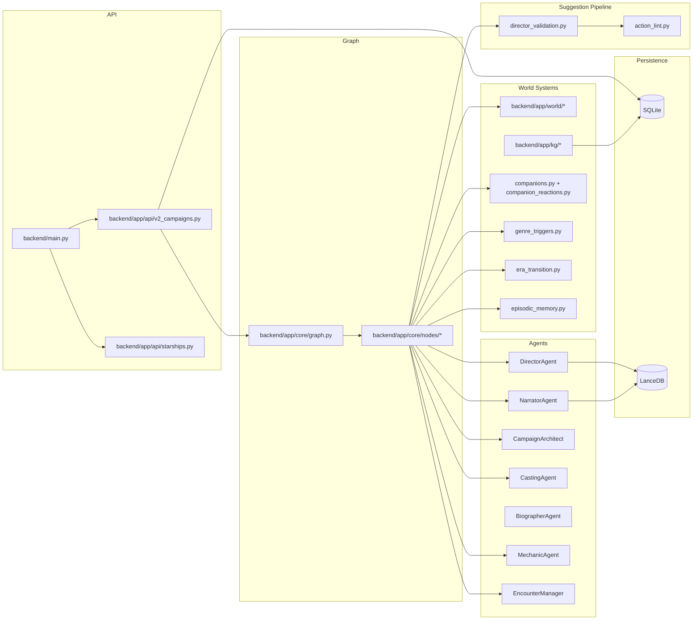

# 01 — Repository Map

## Directory Structure (High-Level)

```
Storyteller AI/
  backend/                       # FastAPI backend + engine runtime
    main.py                      # FastAPI app wiring (V2)
    llm_client.py                # Ollama HTTP client (LLMClient)
    app/
      api/
        v2_campaigns.py          # V2 REST API: setup/create/state/turn/transcript/rumors
        starships.py             # Starship acquisition endpoints
      config.py                  # Per-role LLM config + env flags + paths
      constants.py               # Tuning constants (retries, thresholds, ledger caps, banter pools)
      time_economy.py            # Time costs + WORLD_TICK_INTERVAL_HOURS
      core/
        graph.py                 # LangGraph topology + run_turn()
        nodes/                   # Node implementations (router/mechanic/encounter/world_sim/companion/arc_planner/director/narrator/narrative_validator/suggestion_refiner/commit)
        agents/                  # Director/Narrator/Architect/Casting/Biographer/Mechanic agents
          director_helpers.py    # Director prompt construction helpers
        agent_utils.py           # Shared agent utilities
        state_loader.py          # Build GameState from SQLite
        event_store.py           # Event append/query helpers
        projections.py           # Event -> normalized table projections
        transcript_store.py      # Rendered turn persistence
        ledger.py                # Narrative ledger (prompt grounding)
        warnings.py              # Warning collection helpers
        director_validation.py   # generate_suggestions() + classify_suggestion() + ensure_tone_diversity()
        action_lint.py           # Suggestion linting (NPC/item/travel validation)
        companions.py            # Companion lookup + party management
        companion_reactions.py   # Companion reaction computation + inter-party tensions
        pronouns.py              # Gender/pronoun system (pronoun_block())
        personality_profile.py   # NPC personality profile generation
        genre_triggers.py        # Genre detection (11 genres) + keyword matching
        era_transition.py        # Era transition detection + summary generation
        episodic_memory.py       # Episodic memory compression + retrieval
        suggestion_cache.py      # Suggestion pre-generation cache
        context_budget.py        # Token budgeting for LLM prompts
        json_reliability.py      # JSON parse + retry + repair utilities
        json_repair.py           # JSON repair heuristics
      db/                        # SQLite schema + migration runner
        schema.sql               # Base schema
        migrations/              # Migrations 0001-0018
          0005_knowledge_graph.sql
          0006_add_campaign_created_at.sql
          0007_add_campaign_updated_at.sql
          0008_add_planet.sql
          0009_add_background.sql
          0010_add_character_created_at.sql
          0011_add_character_updated_at.sql
          0012_add_turn_events_created_at.sql
          0013_add_cyoa_answers.sql
          0014_episodic_memories.sql
          0015_add_gender.sql
          0016_suggestion_cache.sql
          0017_starships.sql
          0018_player_profiles.sql
      models/                    # Pydantic models
        state.py                 # GameState, CharacterSheet, ActionSuggestion
        narration.py             # TurnResponse, narration models
        starship.py              # Starship model
        director_schemas.py      # Director output schemas
      rag/                       # LanceDB retrieval + ingestion helpers
        lore_retriever.py        # Lore retrieval (era/planet/faction/doc_type filters)
        style_retriever.py       # 4-lane style retrieval (retrieve_style_layered)
        style_mappings.py        # BASE_STYLE_MAP, ERA_STYLE_MAP, ARCHETYPE_STYLE_MAP
        character_voice_retriever.py  # Era-scoped character voice snippets
        kg_retriever.py          # Knowledge graph runtime retrieval
        retrieval_bundles.py     # Per-agent doc_type/section_kind lane definitions
        utils.py                 # RAG utility functions
        style_ingest.py          # Style document ingestion
        _cache.py                # RAG retrieval caching
      world/                     # Era Packs + deterministic world generation
        era_pack_loader.py       # Load era pack YAML files
        era_pack_models.py       # Era pack Pydantic models
        faction_engine.py        # Deterministic faction engine (no LLM)
        npc_generator.py         # Procedural NPC generation
        npc_renderer.py          # NPC rendering for prompts
      kg/                        # Knowledge graph extraction pipeline
        extractor.py             # KG triple extraction from lore chunks
        store.py                 # KG SQLite persistence
        entity_resolution.py     # Entity deduplication + resolution
        synthesis.py             # KG summary synthesis
      scripts/
        ingest_style.py          # CLI: ingest `data/style/` into style index

  ingestion/                     # Offline ingestion pipelines (flat + hierarchical)
    ingest.py                    # TXT/EPUB -> lore_chunks (flat ~600 tokens)
    ingest_lore.py               # PDF/EPUB/TXT -> lore_chunks (parent/child chunks)
    store.py                     # LanceDB store + stable chunk IDs
    tagger.py                    # Optional LLM metadata enrichment (off by default)
    npc_tagging.py               # NPC entity tagging in lore chunks
    conftest.py                  # Test fixtures for ingestion tests
    __main__.py                  # `python -m ingestion <command>`

  storyteller/                   # Unified CLI dispatcher (installs `storyteller` script)
    cli.py                       # argparse + subcommand registration
    commands/                    # doctor, setup, dev, ingest, query, extract-knowledge
      extract_knowledge.py       # KG extraction command

  shared/                        # Shared config/cache/schemas for backend + ingestion
    schemas.py                   # Shared Pydantic schemas (WorldSimOutput, etc.)
    config.py                    # Shared configuration
    cache.py                     # Shared caching utilities
    lore_metadata.py             # Lore metadata definitions
  scripts/                       # Dev/verification helpers (validate_era_pack.py, verify_lore_store.py, rebuild_lancedb.py)
    extract_sw5e_data.py         # SW5e stat extraction
    ingest_style.py              # Style ingestion script
    split_era_pack.py            # Era pack splitting utility
    validate_era_pack.py         # Era pack YAML validation
  data/                          # Default runtime data
    companions.yaml              # 108 companion definitions (species/voice_tags/motivation/speech_quirk)
    character_aliases.yml        # Character alias mappings
    ui_prefs.json                # UI preference defaults
    static/
      era_packs/                 # Era pack YAML files (per-era NPCs, factions, locations)
    style/
      base/                      # Base Star Wars style (always-on Lane 0)
      era/                       # Era-specific style docs
      genre/                     # Genre-specific style docs
    lore/                        # Lore source files (EPUB/PDF/TXT)
    manifests/                   # Ingestion manifest files

  ingestion_app.py               # Legacy ingestion studio entrypoint (deprecated)
  start_dev.bat                  # Windows: start backend + SvelteKit UI (`python -m storyteller dev`)
  start_backend.bat              # Windows: start backend only
  start_ingestion_ui.bat         # Windows: start ingestion studio

  README.md                      # Main overview + setup + usage
  QUICKSTART.md                  # Quick setup path
  API_REFERENCE.md               # Canonical request/response shapes
  CLAUDE.md                      # AI constraints + coding standards

  docs/                          # All reference documentation
    architecture.md              # Living World architecture write-up
    user_guide.md                # Player/host guide (time, psychology, tone)
    lore_pipeline_guide.md       # Lore folder structure + ingestion workflow
    00_overview.md – 09_call_graph.md  # Internal design docs (learning path)
    archive/                     # Historical references
      review_2025.md
      refactor_notes.md
```

## Entry Points

| Entry Point | File / Command | Purpose |
|------------|------------------|---------|
| **Dev stack (recommended)** | `python -m storyteller dev` | Start backend + UI (and try to start Ollama) |
| **First-time setup** | `python -m storyteller setup` | Create data dirs + copy `.env` + run health check |
| **Health check** | `python -m storyteller doctor` | Verify Python/venv/deps/.env/data dirs/Ollama/LanceDB |
| **API server** | `uvicorn backend.main:app` | Start FastAPI backend |
| **SvelteKit UI** | `npm run dev` (in `frontend/`) | Player-facing UI |
| **Ingestion Studio (legacy)** | `python -m streamlit run ingestion_app.py` | Local ingestion dashboard |
| **Flat ingestion** | `python -m ingestion.ingest ...` | TXT/EPUB ingestion (no PDF) |
| **Hierarchical ingestion** | `python -m ingestion.ingest_lore ...` | PDF/EPUB/TXT parent/child ingestion |
| **KG extraction** | `python -m storyteller extract-knowledge ...` | Build SQLite KG tables from ingested lore |
| **Style ingestion** | `python -m backend.app.scripts.ingest_style ...` | Ingest `data/style/` docs |

## Key Dependency Map (Conceptual)


