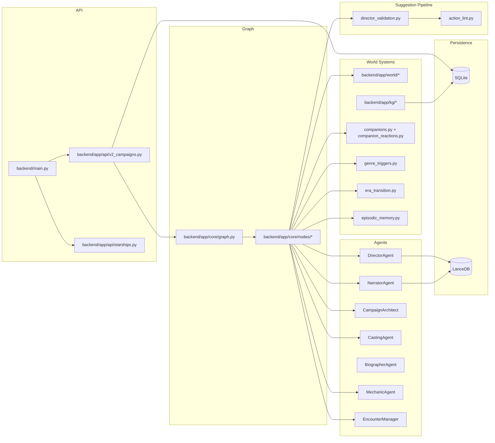

# 01 — Repository Map

## Directory Structure (High-Level)

```text
Storyteller AI/
  backend/                       # FastAPI backend + engine runtime
    main.py                      # FastAPI app wiring (V2)
    llm_client.py                # Ollama HTTP client (LLMClient)
    app/
      api/
        v2_campaigns.py          # V2 REST API: content/era/campaign/player/turn endpoints
        campaign_models.py       # Pydantic request/response models for campaign API
        campaign_setup.py        # Campaign initialization and auto-setup logic
        starships.py             # Starship acquisition endpoints
      config.py                  # Per-role LLM config + env flags + paths
      constants.py               # Tuning constants (retries, thresholds, ledger caps)
      banter_pool.py             # Banter dialogue pool definitions (17 banter styles)
      time_economy.py            # Time costs + WORLD_TICK_INTERVAL_HOURS
      core/
        graph.py                 # LangGraph topology + run_turn()
        nodes/                   # Node implementations (router/mechanic/encounter/world_sim/companion/arc_planner/director/narrator/narrative_validator/suggestion_refiner/commit)
        agents/                  # Director/Narrator/Architect/Casting/Biographer/Mechanic agents
          director_helpers.py    # Director prompt construction helpers
          narrator_prompt.py     # Narrator system prompt and template construction
          narrator_postprocess.py  # Narrator output post-processing (_strip_structural_artifacts, _truncate_overlong_prose, _enforce_pov_consistency, _flag_unknown_entities)
        agent_utils.py           # Shared agent utilities
        state_loader.py          # Build GameState from SQLite
        event_store.py           # Event append/query helpers
        projections.py           # Event -> normalized table projections
        transcript_store.py      # Rendered turn persistence
        ledger.py                # Narrative ledger (prompt grounding)
        warnings.py              # Warning collection helpers
        director_validation.py   # Re-export hub for suggestion pipeline (delegates to suggestion_engine.py + director_context.py)
        director_context.py      # Context builders, validation helpers, and similarity functions for Director
        suggestion_engine.py     # generate_suggestions() + classify_suggestion() + ensure_tone_diversity() (deterministic)
        banter_manager.py        # Banter pool manager for companion dialogue
        action_lint.py           # Suggestion linting (NPC/item/travel validation)
        companions.py            # Companion lookup + party management
        companion_reactions.py   # Companion reaction computation + inter-party tensions
        pronouns.py              # Gender/pronoun system (pronoun_block())
        personality_profile.py   # NPC personality profile generation
        genre_triggers.py        # Genre detection (11 genres) + keyword matching
        era_transition.py        # Era transition detection + summary generation
        episodic_memory.py       # Episodic memory compression + retrieval
        suggestion_cache.py      # Suggestion pre-generation cache
        context_budget.py        # Token budgeting for LLM prompts
        json_reliability.py      # JSON parse + retry + repair utilities
        json_repair.py           # JSON repair heuristics
      db/                        # SQLite schema + migration runner
        schema.sql               # Reference schema
        migrations/              # Migrations 0001-0021
          0001_init.sql          # Core tables (campaigns, characters, inventory, turn_events)
          0002_add_rendered_turns.sql
          0003_add_credits.sql
          0004_living_world.sql  # Objectives table
          0005_knowledge_graph.sql
          0006-0012_timestamps.sql  # Various created_at/updated_at additions
          0013_add_cyoa_answers.sql
          0014_episodic_memories.sql
          0015_add_gender.sql
          0016_suggestion_cache.sql
          0017_starships.sql
          0018_player_profiles.sql  # Cross-campaign legacy
          0019_turn_contract_passages.sql  # Passage mode support
          0020_campaign_turn_versioning.sql  # Turn versioning + world time
          0021_episodic_memory_embedding.sql  # Memory embeddings
      models/                    # Pydantic models
        state.py                 # GameState, CharacterSheet, ActionSuggestion
        narration.py             # TurnResponse, narration models
        starship.py              # Starship model
        director_schemas.py      # Director output schemas
      rag/                       # LanceDB retrieval + ingestion helpers
        lore_retriever.py        # Lore retrieval (era/planet/faction/doc_type filters)
        style_retriever.py       # 4-lane style retrieval (retrieve_style_layered)
        style_mappings.py        # BASE_STYLE_MAP, ERA_STYLE_MAP, ARCHETYPE_STYLE_MAP
        character_voice_retriever.py  # Era-scoped character voice snippets
        kg_retriever.py          # Knowledge graph runtime retrieval
        retrieval_bundles.py     # Per-agent doc_type/section_kind lane definitions
        utils.py                 # RAG utility functions
        style_ingest.py          # Style document ingestion
        _cache.py                # RAG retrieval caching
      world/                     # Setting Packs + deterministic world generation
        setting_pack_loader.py   # Setting pack loader (thin wrapper)
        era_pack_models.py       # Pack Pydantic models (EraPack for backward compat)
        faction_engine.py        # Deterministic faction engine (no LLM)
        npc_generator.py         # Procedural NPC generation
        npc_renderer.py          # NPC rendering for prompts
      kg/                        # Knowledge graph extraction pipeline
        extractor.py             # KG triple extraction from lore chunks
        store.py                 # KG SQLite persistence
        entity_resolution.py     # Entity deduplication + resolution
        synthesis.py             # KG summary synthesis
  ingestion/                     # Offline lore ingestion pipeline
    ingest_lore.py               # PDF/EPUB/TXT -> lore_chunks (parent/child chunks)
    store.py                     # LanceDB store + stable chunk IDs
    tagger.py                    # Optional LLM metadata enrichment (off by default)
    npc_tagging.py               # NPC entity tagging in lore chunks
    conftest.py                  # Test fixtures for ingestion tests
    __main__.py                  # `python -m ingestion <command>`


  frontend/                      # SvelteKit UI
    src/routes/+page.svelte      # Landing page
    src/routes/create/+page.svelte # Campaign creation flow
    src/routes/play/+page.svelte # Main gameplay view
    src/lib/api/                 # HTTP + SSE client helpers
    src/lib/stores/              # UI and gameplay stores

  storyteller/                   # Unified CLI dispatcher (installs `storyteller` script)
    cli.py                       # argparse + subcommand registration
    commands/                    # doctor, setup, dev, ingest, query, extract-knowledge
      extract_knowledge.py       # KG extraction command

  shared/                        # Shared config/cache/schemas for backend + ingestion
    schemas.py                   # Shared Pydantic schemas (WorldSimOutput, etc.)
    config.py                    # Shared configuration
    cache.py                     # Shared caching utilities
    lore_metadata.py             # Lore metadata definitions

  scripts/                       # Dev/verification helpers
    validate_era_packs.py        # Validate all era/setting packs
    validate_setting_packs.py    # Setting pack validation (core)
    smoke_test.py                # Smoke test for backend
    run_deterministic_tests.py   # Run deterministic tests
    preflight.py                 # Preflight checks
    ingest_style.py              # Style ingestion script
    rebuild_lancedb.py           # Rebuild vector DB
    verify_lore_store.py         # Verify lore storage

  data/                          # Default runtime data
    companions.yaml              # 108 companion definitions (species/voice_tags/motivation/speech_quirk)
    character_aliases.yml        # Character alias mappings
    static/
      era_packs/                 # Era pack YAML files (deterministic world content)
        _template/               # Reference structure for authoring new packs
        dark_times/              # Playable period pack
        rebellion/               # Playable period pack
        new_republic/            # Playable period pack
        new_jedi_order/          # Playable period pack
          era.yaml, companions.yaml, quests.yaml, meters.yaml, npcs.yaml,
          namebanks.yaml, factions.yaml, events.yaml, locations.yaml,
          rumors.yaml, facts.yaml, backgrounds.yaml
      starships.yaml             # Starship database
      SETTING_PACK_PROMPT_TEMPLATE.md
      STYLE_PROMPT_TEMPLATE.md
    style/
      base/                      # Base Star Wars style (always-on Lane 0)
      era/                       # Era-specific style docs
      genre/                     # Genre-specific style docs
    lore/                        # Lore source files (EPUB/PDF/TXT)
    manifests/                   # Ingestion manifest files

  start_app.bat                  # Windows: unified launcher wrapper (backend + UI)
  run_app.py                     # Cross-platform launcher with preflight/check modes

  README.md                      # Main overview + setup + usage
  QUICKSTART.md                  # Quick setup path

  docs/                          # All reference documentation
    00_overview.md – 09_call_graph.md  # Internal design docs (sequential learning path)
```

## Entry Points

| Entry Point | File / Command | Purpose |
| ------------ | ------------------ | --------- |
| **Dev stack (recommended)** | `python run_app.py --dev` | Start backend + UI with preflight checks |
| **Alternative dev launcher** | `python -m storyteller dev` | Start backend + UI from CLI command |
| **First-time setup** | `python -m storyteller setup` | Create data dirs + copy `.env` + run health check |
| **Health check** | `python -m storyteller doctor` | Verify Python/venv/deps/.env/data dirs/Ollama/LanceDB |
| **API server** | `uvicorn backend.main:app` | Start FastAPI backend |
| **SvelteKit UI** | `npm run dev` (in `frontend/`) | Player-facing UI |
| **Hierarchical ingestion** | `python -m ingestion.ingest_lore ...` | PDF/EPUB/TXT parent/child ingestion |
| **KG extraction** | `python -m storyteller extract-knowledge ...` | Build SQLite KG tables from ingested lore |
| **Style ingestion** | `python scripts/ingest_style.py ...` | Ingest `data/style/` docs |

## Key Dependency Map (Conceptual)


```mermaid
graph LR
    subgraph API
        main[backend/main.py]
        v2[backend/app/api/v2_campaigns.py]
        starships[backend/app/api/starships.py]
    end

    subgraph Graph
        graph_mod[backend/app/core/graph.py]
        nodes[backend/app/core/nodes/*]
    end

    subgraph Agents
        dir[DirectorAgent]
        nar[NarratorAgent]
        arch[CampaignArchitect]
        cast[CastingAgent]
        bio[BiographerAgent]
        mech[MechanicAgent]
        enc[EncounterManager]
    end

    subgraph "Suggestion Pipeline"
        dv[director_validation.py]
        al[action_lint.py]
    end

    subgraph "World Systems"
        world[backend/app/world/*]
        kg[backend/app/kg/*]
        companions[companions.py + companion_reactions.py]
        genre[genre_triggers.py]
        era[era_transition.py]
        episodic[episodic_memory.py]
    end

    subgraph Persistence
        db[(SQLite)]
        ldb[(LanceDB)]
    end

    main --> v2 --> graph_mod --> nodes
    main --> starships
    nodes --> mech
    nodes --> enc
    nodes --> dir --> ldb
    nodes --> nar --> ldb
    nodes --> arch
    nodes --> cast
    nodes --> companions
    nodes --> dv --> al
    nodes --> world
    nodes --> genre
    nodes --> era
    nodes --> episodic
    v2 --> db
    kg --> db
```
