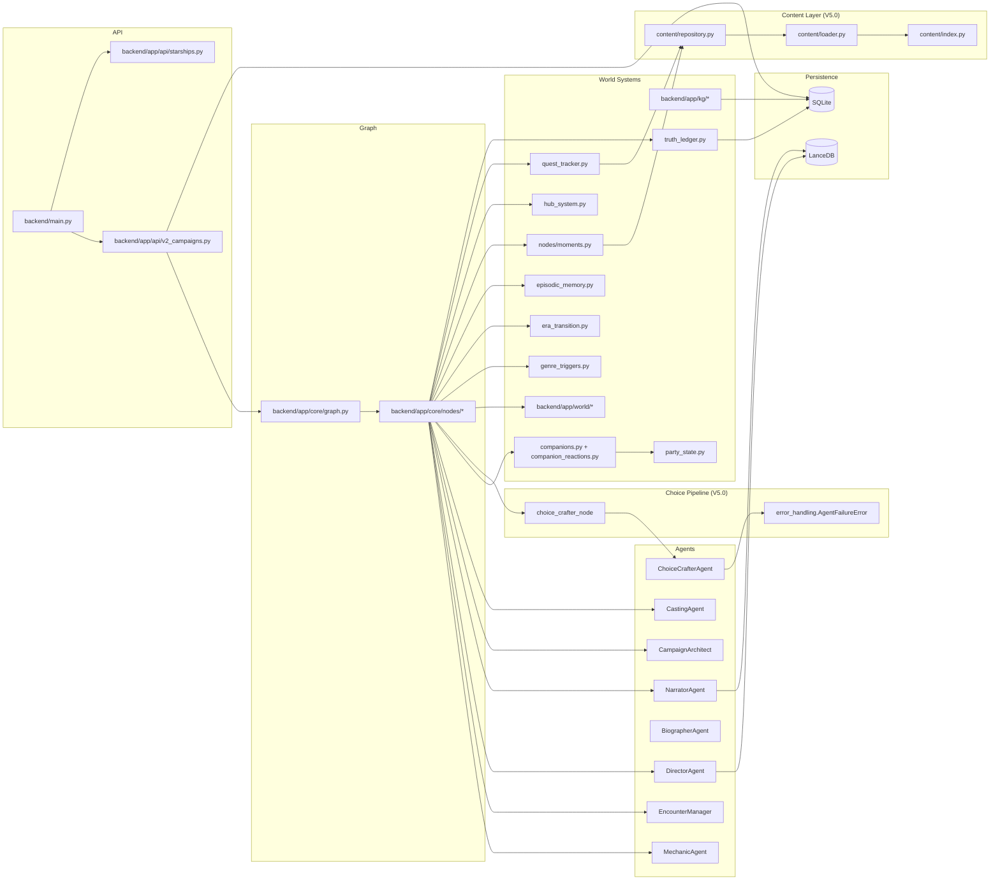

# 01 — Repository Map

## Directory Structure (High-Level)

```text
Storyteller AI/
  backend/                       # FastAPI backend + engine runtime
    main.py                      # FastAPI app wiring (V2)
    llm_client.py                # Ollama HTTP client (LLMClient)
    app/
      api/
        v2_campaigns.py          # V2 REST API: content/era/campaign/player/turn endpoints
        campaign_models.py       # Pydantic request/response models for campaign API
        campaign_setup.py        # Campaign initialization and auto-setup logic
        starships.py             # Starship acquisition endpoints
      config.py                  # Per-role LLM config + env flags + paths
      constants.py               # Tuning constants (retries, thresholds, ledger caps)
      banter_pool.py             # Banter dialogue pool definitions (17 banter styles)
      time_economy.py            # Time costs + WORLD_TICK_INTERVAL_HOURS
      content/                   # Content loading layer (V5.0)
        loader.py                # Stacked period content loader + era-id resolution
        repository.py            # ContentRepository singleton (thread-safe, (setting_id, period_id) keyed)
        index.py                 # ContentIndices: searchable location/NPC/faction lookup
        types.py                 # Shared content type aliases
        resolvers/               # Location/NPC/mission resolvers
      core/
        graph.py                 # LangGraph topology + run_turn() + AgentFailureError handling
        nodes/                   # Node implementations
          router.py              # router_node + meta_node
          mechanic.py            # make_mechanic_node()
          encounter.py           # make_encounter_node()
          world_sim.py           # make_world_sim_node()
          companion.py           # companion_reaction_node
          moments.py             # moments_node (V5.0 — EraMoment trigger system)
          arc_planner.py         # arc_planner_node
          scene_frame.py         # scene_frame_node
          director.py            # make_director_node()
          narrator.py            # make_narrator_node()
          narrative_validator.py # narrative_validator_node
          choice_crafter_node.py # make_choice_crafter_node() (V5.0 — replaces suggestion_refiner)
          commit.py              # make_commit_node() — single transaction boundary
        agents/                  # LLM-powered and deterministic agents
          base.py                # AgentLLM wrapper (Ollama-only, JSON mode, repair retry)
          director.py            # DirectorAgent — text-only scene instructions via LLM
          director_helpers.py    # Director prompt construction helpers
          narrator.py            # NarratorAgent — prose generation via LLM
          narrator_prompt.py     # Narrator system prompt + template construction
          narrator_postprocess.py  # Narrator post-processing (strip artifacts, truncate, POV)
          mechanic.py            # MechanicAgent — deterministic dice/DC/time (no LLM)
          architect.py           # CampaignArchitect — campaign blueprint + WorldSim off-screen
          biographer.py          # BiographerAgent — character background generation
          casting.py             # CastingAgent — legacy LLM NPC casting (rarely used)
          encounter.py           # EncounterManager — deterministic NPC selection
          choice_crafter_agent.py  # ChoiceCrafterAgent — LLM-driven player choice generation (V5.0)
          companion_system_agent.py # CompanionSystemAgent — extended companion interactions (V5.0)
          continuity_agent.py    # ContinuityAgent — narrative continuity checks (V5.0)
          era_transition_scene_agent.py # Era transition scene generation (V5.0)
          intent_router_agent.py # LLM-assisted intent routing (V5.0)
          memory_agent.py        # MemoryAgent — long-term memory management (V5.0)
          progression_agent.py   # ProgressionAgent — player/story progression (V5.0)
          prologue_agent.py      # PrologueAgent — campaign opening scene (V5.0)
          psych_archivist_agent.py # PsychArchivistAgent — psychology profile updates (V5.0)
          quest_weaver_agent.py  # QuestWeaverAgent — quest narrative generation (V5.0)
          resolution_agent.py    # ResolutionAgent — story resolution scenes (V5.0)
          arc_screenplay_agent.py  # ArcScreenplayAgent — act-level screenplay planning (V5.0)
          arc_weaver_agent.py    # ArcWeaverAgent — thread weaving between arcs (V5.0)
          world_mind_agent.py    # WorldMindAgent — LLM-driven world simulation (V5.0)
        agent_utils.py           # Shared agent utilities
        error_handling.py        # AgentFailureError + authoritative_call() + log_error_with_context() (V5.0)
        state_loader.py          # Build GameState from SQLite
        event_store.py           # Event append/query helpers
        projections.py           # Event -> normalized table projections (alias for state_reducer)
        state_reducer.py         # Event -> normalized table projections (canonical)
        transcript_store.py      # Rendered turn persistence
        ledger.py                # Narrative ledger (prompt grounding, established_facts, open_threads)
        truth_ledger.py          # SQLite-backed truth facts + contradiction checks (V5.0)
        warnings.py              # Warning collection helpers
        director_validation.py   # Re-export hub (delegates to suggestion_engine.py + director_context.py)
        director_context.py      # Context builders, validation helpers, similarity functions for Director
        suggestion_engine.py     # generate_suggestions() + classify_suggestion() + ensure_tone_diversity()
        banter_manager.py        # Banter pool manager for companion dialogue
        action_lint.py           # Suggestion linting (NPC/item/travel validation)
        companions.py            # Companion lookup + party management
        companion_reactions.py   # Companion reaction computation + inter-party tensions
        party_state.py           # PartyState + CompanionRuntimeState models + influence system (V5.0)
        pronouns.py              # Gender/pronoun system (pronoun_block())
        personality_profile.py   # NPC personality profile generation
        genre_triggers.py        # Genre detection (11 genres) + keyword matching
        era_transition.py        # Era transition detection + summary generation
        episodic_memory.py       # Episodic memory compression + retrieval
        suggestion_cache.py      # Suggestion pre-generation cache
        context_budget.py        # Token budgeting for LLM prompts
        json_reliability.py      # JSON parse + retry + repair utilities
        json_repair.py           # JSON repair heuristics
        hub_system.py            # Hub/downtime mode detection + Director prompt injection (V5.0)
        quest_tracker.py         # Deterministic quest state machine (V5.0)
        npc_memory.py            # NPC memory tracking across turns (V5.0)
        arc_consequence_tracker.py  # Arc consequence tracking for Director context (V5.0)
        campaign_init.py         # Campaign initialization utilities (V5.0)
        codex_discovery.py       # Codex/lore discovery tracking (V5.0)
        mechanics_resolver.py    # Extended mechanics resolution helpers (V5.0)
        setting_context.py       # get_setting_rules(state) helper (V5.0)
        story_position.py        # Story position tracking for arc progression (V5.0)
        text_utils.py            # Shared text utility functions (V5.0)
        turn_contract.py         # Turn contract builders/validators
        llm_provider.py          # LLM client abstraction layer
        prologue_engine.py       # Campaign opening / prologue engine (V5.0)
        canon_scheduler.py       # Historical timeline canon event scheduler (V7.0)
        consequence_propagator.py  # Sandbox consequence propagation: ripple/wave/tsunami tiers (V7.0)
        deferred_agents.py       # Post-commit deferred maintenance agent runner (V7.0)
      db/                        # SQLite schema + migration runner
        schema.sql               # Reference schema
        migrations/              # Migrations 0001-0021
          0001_init.sql          # Core tables (campaigns, characters, inventory, turn_events)
          0002_add_rendered_turns.sql
          0003_add_credits.sql
          0004_living_world.sql  # Objectives table
          0005_knowledge_graph.sql
          0006-0012_timestamps.sql  # Various created_at/updated_at additions
          0013_add_cyoa_answers.sql
          0014_episodic_memories.sql
          0015_add_gender.sql
          0016_suggestion_cache.sql
          0017_starships.sql
          0018_player_profiles.sql  # Cross-campaign legacy
          0019_turn_contract_passages.sql  # TurnContract schema additions
          0020_campaign_turn_versioning.sql  # Turn versioning + world time
          0021_episodic_memory_embedding.sql  # Memory embeddings
      models/                    # Pydantic models
        state.py                 # GameState, CharacterSheet, ActionSuggestion
        narration.py             # TurnResponse, narration models
        starship.py              # Starship model
        turn_contract.py         # TurnContract + Fact + component models
        news.py                  # News feed models (rumors_to_news_feed)
      rag/                       # LanceDB retrieval + ingestion helpers
        lore_retriever.py        # Lore retrieval (era/planet/faction/doc_type filters)
        style_retriever.py       # 4-lane style retrieval (retrieve_style_layered)
        style_mappings.py        # BASE_STYLE_MAP, ERA_STYLE_MAP, ARCHETYPE_STYLE_MAP
        character_voice_retriever.py  # Era-scoped character voice snippets
        kg_retriever.py          # Knowledge graph runtime retrieval
        retrieval_bundles.py     # Per-agent doc_type/section_kind lane definitions
        utils.py                 # RAG utility functions
        style_ingest.py          # Style document ingestion
        _cache.py                # RAG retrieval caching
      world/                     # Setting Packs + deterministic world generation
        setting_pack_loader.py   # Setting pack loader (thin wrapper)
        era_pack_models.py       # Pack Pydantic models (EraPack, SettingRules, EraMoment, etc.)
        faction_engine.py        # Deterministic faction engine (no LLM)
        npc_generator.py         # Procedural NPC generation
        npc_renderer.py          # NPC rendering for prompts
      kg/                        # Knowledge graph extraction pipeline
        extractor.py             # KG triple extraction from lore chunks
        store.py                 # KG SQLite persistence
        entity_resolution.py     # Entity deduplication + resolution
        synthesis.py             # KG summary synthesis

  ingestion/                     # Offline lore ingestion pipeline
    ingest_lore.py               # PDF/EPUB/TXT -> lore_chunks (parent/child chunks)
    store.py                     # LanceDB store + stable chunk IDs
    tagger.py                    # Optional LLM metadata enrichment (off by default)
    npc_tagging.py               # NPC entity tagging in lore chunks
    conftest.py                  # Test fixtures for ingestion tests
    __main__.py                  # `python -m ingestion <command>`

  frontend/                      # SvelteKit UI
    src/routes/+page.svelte      # Landing page
    src/routes/create/+page.svelte # Campaign creation flow
    src/routes/play/+page.svelte # Main gameplay view
    src/lib/api/                 # HTTP + SSE client helpers
    src/lib/stores/              # UI and gameplay stores

  storyteller/                   # Unified CLI dispatcher (installs `storyteller` script)
    cli.py                       # argparse + subcommand registration
    commands/                    # doctor, setup, dev, ingest, query, extract-knowledge
      extract_knowledge.py       # KG extraction command

  shared/                        # Shared config/cache/schemas for backend + ingestion
    schemas.py                   # Shared Pydantic schemas (WorldSimOutput, etc.)
    config.py                    # Shared configuration (EMBEDDING_MODEL, paths)
    cache.py                     # Shared caching utilities
    lore_metadata.py             # Lore metadata definitions
    ingest_paths.py              # Ingestion path resolution

  scripts/                       # Dev/verification helpers
    validate_era_packs.py        # Validate all era/setting packs
    validate_setting_packs.py    # Setting pack validation (core)
    smoke_test.py                # Smoke test for backend
    run_deterministic_tests.py   # Run deterministic tests
    preflight.py                 # Preflight checks
    ingest_style.py              # Style ingestion script
    rebuild_lancedb.py           # Rebuild vector DB
    verify_lore_store.py         # Verify lore storage

  data/                          # Default runtime data
    companions.yaml              # 108 companion definitions (species/voice_tags/motivation/speech_quirk)
    character_aliases.yml        # Character alias mappings
    static/
      era_packs/                 # Era pack YAML files (deterministic world content)
        _template/               # Reference structure for authoring new packs
        dark_times/              # Skeleton pack (era.yaml, backgrounds.yaml, species.yaml)
        rebellion/               # Starter pack (era.yaml, backgrounds.yaml, species.yaml, canon_events.json)
        new_republic/            # Skeleton pack (era.yaml, backgrounds.yaml, species.yaml, canon_events.json)
        new_jedi_order/          # Skeleton pack (era.yaml, backgrounds.yaml, species.yaml)
        forgotten_realms/        # Setting-agnostic proof (era.yaml, backgrounds.yaml, species.yaml)
      starships.yaml             # Starship database
      SETTING_PACK_PROMPT_TEMPLATE.md
      STYLE_PROMPT_TEMPLATE.md
    style/
      base/                      # Base Star Wars style (always-on Lane 0)
      era/                       # Era-specific style docs
      genre/                     # Genre-specific style docs
    lore/                        # Lore source files (EPUB/PDF/TXT)
    manifests/                   # Ingestion manifest files

  start_app.bat                  # Windows: unified launcher wrapper (backend + UI)
  run_app.py                     # Cross-platform launcher with preflight/check modes

  README.md                      # Main overview + setup + usage
  QUICKSTART.md                  # Quick setup path

  docs/                          # All reference documentation
    00_overview.md – 10_agent_execution_matrix.md  # Internal design docs (sequential learning path)
    HYBRID_CLOUD_SETUP.md        # Hybrid local+cloud LLM configuration guide
    RELEASE_CHECKLIST.md         # Pre-release verification checklist
    OPERATIONS_RUNBOOK.md        # Incident playbooks and operational procedures
```

## Entry Points

| Entry Point | File / Command | Purpose |
| ------------ | ------------------ | --------- |
| **Dev stack (recommended)** | `python run_app.py --dev` | Start backend + UI with preflight checks |
| **Alternative dev launcher** | `python -m storyteller dev` | Start backend + UI from CLI command |
| **First-time setup** | `python -m storyteller setup` | Create data dirs + copy `.env` + run health check |
| **Health check** | `python -m storyteller doctor` | Verify Python/venv/deps/.env/data dirs/Ollama/LanceDB |
| **API server** | `uvicorn backend.main:app` | Start FastAPI backend |
| **SvelteKit UI** | `npm run dev` (in `frontend/`) | Player-facing UI |
| **Hierarchical ingestion** | `python -m ingestion.ingest_lore ...` | PDF/EPUB/TXT parent/child ingestion |
| **KG extraction** | `python -m storyteller extract-knowledge ...` | Build SQLite KG tables from ingested lore |
| **Style ingestion** | `python scripts/ingest_style.py ...` | Ingest `data/style/` docs |

## Key Dependency Map (Conceptual)


```mermaid
graph LR
    subgraph API
        main[backend/main.py]
        v2[backend/app/api/v2_campaigns.py]
        starships[backend/app/api/starships.py]
    end

    subgraph Graph
        graph_mod[backend/app/core/graph.py]
        nodes[backend/app/core/nodes/*]
    end

    subgraph Agents
        dir[DirectorAgent]
        nar[NarratorAgent]
        arch[CampaignArchitect]
        cast[CastingAgent]
        bio[BiographerAgent]
        mech[MechanicAgent]
        enc[EncounterManager]
        cc[ChoiceCrafterAgent]
    end

    subgraph "Choice Pipeline (V5.0)"
        cc_node[choice_crafter_node]
        err[error_handling.AgentFailureError]
    end

    subgraph "World Systems"
        world[backend/app/world/*]
        kg[backend/app/kg/*]
        companions[companions.py + companion_reactions.py]
        party[party_state.py]
        genre[genre_triggers.py]
        era[era_transition.py]
        episodic[episodic_memory.py]
        hub[hub_system.py]
        quest[quest_tracker.py]
        truth[truth_ledger.py]
        moments[nodes/moments.py]
    end

    subgraph "Content Layer (V5.0)"
        repo[content/repository.py]
        content_loader[content/loader.py]
        content_idx[content/index.py]
    end

    subgraph Persistence
        db[(SQLite)]
        ldb[(LanceDB)]
    end

    main --> v2 --> graph_mod --> nodes
    main --> starships
    nodes --> mech
    nodes --> enc
    nodes --> dir --> ldb
    nodes --> nar --> ldb
    nodes --> arch
    nodes --> cast
    nodes --> companions --> party
    nodes --> cc_node --> cc --> err
    nodes --> world
    nodes --> genre
    nodes --> era
    nodes --> episodic
    nodes --> moments --> repo
    nodes --> hub
    nodes --> quest --> repo
    nodes --> truth
    repo --> content_loader --> content_idx
    v2 --> db
    kg --> db
    truth --> db
```

## V7.0 New Modules Summary

| Module | Purpose |
| ------- | ------- |
| `backend/app/core/canon_scheduler.py` | Historical timeline scheduler — loads canon events from era packs, records triggered events, surfaces via arc_guidance |
| `backend/app/core/consequence_propagator.py` | Sandbox consequence propagation — ripple/wave/tsunami impact tiers with multi-turn duration tracking |
| `backend/app/core/deferred_agents.py` | Post-commit deferred maintenance agent runner — MemoryAgent, QuestWeaver, ProgressionAgent, PsychArchivist |
| `backend/app/db/connection.py` | WAL mode connection factory — `PRAGMA journal_mode=WAL` + `PRAGMA busy_timeout=5000` |

## V5.0 New Modules Summary

| Module | Purpose |
| ------- | ------- |
| `backend/app/content/repository.py` | Thread-safe `ContentRepository` singleton — replaces direct era-pack loading |
| `backend/app/content/loader.py` | Stacked period content loader, era-id normalization |
| `backend/app/content/index.py` | Searchable content index (locations, NPCs, factions) |
| `backend/app/core/nodes/moments.py` | `moments_node` — EraMoment trigger system |
| `backend/app/core/nodes/choice_crafter_node.py` | `make_choice_crafter_node()` — authoritative LLM choices |
| `backend/app/core/agents/choice_crafter_agent.py` | `generate_choices()` — scene-aware player choice generation |
| `backend/app/core/agents/world_mind_agent.py` | LLM-driven world simulation (WorldMind) |
| `backend/app/core/agents/companion_system_agent.py` | Extended companion interactions |
| `backend/app/core/agents/continuity_agent.py` | Narrative continuity enforcement |
| `backend/app/core/agents/era_transition_scene_agent.py` | Era transition scene generation |
| `backend/app/core/agents/intent_router_agent.py` | LLM-assisted intent routing |
| `backend/app/core/agents/memory_agent.py` | Long-term memory management |
| `backend/app/core/agents/progression_agent.py` | Player/story progression tracking |
| `backend/app/core/agents/prologue_agent.py` | Campaign opening scene |
| `backend/app/core/agents/psych_archivist_agent.py` | Psychology profile updates |
| `backend/app/core/agents/quest_weaver_agent.py` | Quest narrative generation |
| `backend/app/core/agents/resolution_agent.py` | Story resolution scenes |
| `backend/app/core/agents/arc_screenplay_agent.py` | Act-level screenplay planning |
| `backend/app/core/agents/arc_weaver_agent.py` | Thread weaving between arcs |
| `backend/app/core/error_handling.py` | `AgentFailureError`, `authoritative_call()`, `log_error_with_context()` |
| `backend/app/core/hub_system.py` | Hub/downtime mode detection, Director prompt injection |
| `backend/app/core/quest_tracker.py` | Deterministic `QuestTracker` state machine |
| `backend/app/core/truth_ledger.py` | SQLite `truth_facts` table, `contradiction_errors()` |
| `backend/app/core/party_state.py` | `PartyState` + `CompanionRuntimeState` models |
| `backend/app/core/setting_context.py` | `get_setting_rules(state)` helper |
| `backend/app/core/state_reducer.py` | Event → normalized table projections (canonical; alias: `projections.py`) |
| `backend/app/core/npc_memory.py` | NPC memory tracking across turns |
| `backend/app/core/arc_consequence_tracker.py` | Arc consequence tracking for Director |
| `backend/app/core/campaign_init.py` | Campaign initialization utilities |
| `backend/app/core/codex_discovery.py` | Codex/lore discovery tracking |
| `backend/app/core/mechanics_resolver.py` | Extended mechanics resolution helpers |
| `backend/app/core/story_position.py` | Story position tracking for arc progression |
| `backend/app/core/text_utils.py` | Shared text utility functions |
| `backend/app/core/prologue_engine.py` | Campaign opening/prologue engine |
