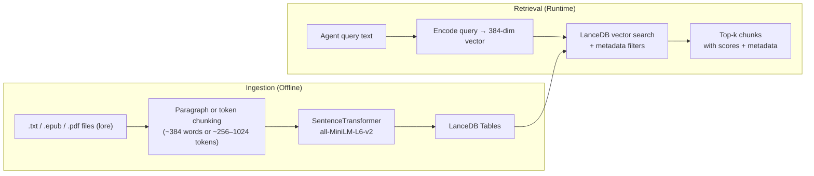

# 05 — RAG & Ingestion Pipeline

## Architecture Overview



## Era Packs (Bible) + RAG Library

- Era Packs are deterministic world state (factions, locations, NPCs). They live in `data/static/era_packs/`.
- Format: either a single YAML file per era (legacy) **or** a folder per era (recommended) containing `era.yaml` plus modular files like `locations.yaml`, `factions.yaml`, `npcs.yaml`, and `namebanks.yaml` (and/or subfolders such as `locations/*.yaml`).
- RAG is a referenced library used for flavor and grounding, not entity discovery.
- Alias/voice facets are not implemented; the feature is disabled by default (`ENABLE_CHARACTER_FACETS=0`) and the implementation is incomplete.

## Vector Database: LanceDB

**Path:** Configured via `VECTORDB_PATH` env var. If unset, defaults to `<STORYTELLER_INGEST_ROOT>/lancedb` (or `./data/lancedb` when `STORYTELLER_INGEST_ROOT` is not set).

LanceDB is an embedded columnar vector database (no server needed). Tables are stored as Lance files on disk. Connections and table handles are cached per path in `backend/app/rag/_cache.py`.

### Tables

| Table Name | Config Constant | Used By | Purpose |
|-----------|----------------|---------|---------|
| `lore_chunks` | `LORE_TABLE_NAME` (`config.py`) | Narrator, Director | Lore from novels, sourcebooks, adventure docs |
| `style_chunks` | `STYLE_TABLE_NAME` (`config.py`) | Director (via layered retrieval) | Writing style/tone reference material (4-lane) |
| `character_voice_chunks` | `CHARACTER_VOICE_TABLE_NAME` (`config.py`) | Narrator | Character-specific dialogue voice samples |

## Embedding Model

**Model:** `sentence-transformers/all-MiniLM-L6-v2` (default)
**Dimension:** 384
**Defined in:** `shared/config.py` (re-exported via `backend/app/config.py`) — `EMBEDDING_MODEL`, `EMBEDDING_DIMENSION`

All retrieval and ingestion modules use these config values. Override via env: `EMBEDDING_MODEL`, `EMBEDDING_DIMENSION`.

**Lazy loading (cached):** The encoder is instantiated on first call and cached per model name (see `backend/app/rag/_cache.py`). Requires `sentence-transformers` pip package.

**Dimension enforcement:** If LanceDB table vector dimension does not match config, retrieval fails fast with a clear message instructing you to run `scripts/rebuild_lancedb.py`.

### Switching Embeddings (bge-m3, nomic-embed-text)

To use a different embedding model, set env vars and rebuild LanceDB:

| Model | EMBEDDING_MODEL | EMBEDDING_DIMENSION |
|-------|-----------------|---------------------|
| Default (all-MiniLM-L6-v2) | `sentence-transformers/all-MiniLM-L6-v2` | 384 |
| BGE-M3 (higher quality) | `BAAI/bge-m3` | 1024 |
| Nomic Embed Text v1.5 | `nomic-ai/nomic-embed-text-v1.5` | 768 |

**Steps:**
1. Set env vars: `EMBEDDING_MODEL`, `EMBEDDING_DIMENSION` (see table above).
2. Run rebuild script: `python scripts/rebuild_lancedb.py --db ./data/lancedb`
3. Ensure `--lore-dir` and `--style-dir` point to your source docs (or use `LORE_DATA_DIR`, `STYLE_DATA_DIR`).

**bge-m3 example:**
```bash
EMBEDDING_MODEL=BAAI/bge-m3 EMBEDDING_DIMENSION=1024 python scripts/rebuild_lancedb.py --db ./data/lancedb
```

**nomic-embed-text:v1.5 (sentence-transformers):**
```bash
EMBEDDING_MODEL=nomic-ai/nomic-embed-text-v1.5 EMBEDDING_DIMENSION=768 python scripts/rebuild_lancedb.py --db ./data/lancedb
```

Note: `nomic-embed-text` via Ollama has different dimensions; use the sentence-transformers variant above for consistency.

### Portable ingestion bundle (plug-and-play)

Set `STORYTELLER_INGEST_ROOT` to move all ingestion assets into one folder you can copy between machines:

- `<INGEST_ROOT>/lore`
- `<INGEST_ROOT>/style`
- `<INGEST_ROOT>/manifests`
- `<INGEST_ROOT>/lancedb`

Example:

```bash
export STORYTELLER_INGEST_ROOT="$HOME/Documents/Storyteller-AI-ingestion-data"
storyteller setup --skip-deps
storyteller ingest --pipeline lore
```

You can also override per-run with `storyteller ingest --ingest-root <path>`.

## Ingestion Pipeline

**Available ingestion methods:**
- **Hierarchical lore ingestion**: `python -m ingestion.ingest_lore ...` (supports PDF/EPUB/TXT with parent/child chunking)
- **Flat lore ingestion**: `python -m ingestion.ingest ...` (TXT/EPUB only, simple chunking)
- **Style ingestion**: `python -m backend.app.scripts.ingest_style ...` or `scripts/ingest_style.py`
- **Verify/query**: `scripts/verify_lore_store.py`, `python -m ingestion query`

For detailed ingestion workflows, see `/docs/lore_pipeline_guide.md`.

### Automated style-pack generation (Hybrid Option A)

You can reduce manual style authoring with:

```bash
storyteller build-style-pack --input <corpus_root> --output <style_root>
```

This command:
- performs deterministic extraction from your corpus,
- generates base + era + top genre style docs,
- optionally polishes output with an LLM (`--use-llm --llm-role ingestion_tagger`),
- writes `_style_pack_manifest.json` for traceability.

Then ingest the generated style docs:

```bash
python scripts/ingest_style.py --input <style_root>
```

Recommended production flow: deterministic generation + optional cloud polish + human review + ingest.

### Style Ingestion

**File:** `backend/app/rag/style_ingest.py` — `ingest_style_dir(data_dir)`

**Input:** Directory of `.txt` and `.md` files containing writing style examples.

**Process:**
1. Collect `.txt` and `.md` files recursively (`_collect_files()`, skipping `README` and `PROMPT_TEMPLATE` stems)
2. For each file:
   - Read text content (UTF-8 with error replacement)
   - Split by double-newline into paragraphs
   - Merge paragraphs until ~384 words per chunk (`_chunk_by_paragraphs()`)
   - Encode all chunks into 384-dim vectors
   - Upsert: delete existing chunks for this source title, then add new rows
3. Each row stored with: `id`, `text`, `vector`, `source_title`, `source_type`, `tags_json`, `chunk_index`

**Table schema** (PyArrow):
```
id: string
text: string
vector: list<float32>[384]
source_title: string
source_type: string ("book" | "article" | "notes")
tags_json: string (JSON array)
chunk_index: int32
```

**CLI entry point:** `backend/app/scripts/ingest_style.py`

### Lore Ingestion

**Files:** `ingestion/ingest.py` (flat TXT/EPUB) and `ingestion/ingest_lore.py` (hierarchical PDF/EPUB/TXT). The lore retriever (`lore_retriever.py`) expects a LanceDB table with rich metadata columns populated by these scripts.

**Expected lore table schema** (inferred from `lore_retriever.py` column access):
```
text: string            — chunk content
vector: list<float32>   — embedding vector
era: string             — time period / era
time_period: string     — more specific time marker
planet: string          — location/planet
faction: string         — associated faction
source_type: string     — "novel", "sourcebook", etc.
doc_type: string        — document classification
section_kind: string    — "lore", "location", "faction", "hook", "rules", "gear"
characters_json: string — JSON array of character names in this chunk
book_title: string      — source book/document title
chapter_title: string   — chapter within source
chunk_id: string        — unique chunk identifier
```

## Retrieval Modules

### Lore Retriever

**File:** `backend/app/rag/lore_retriever.py` — `retrieve_lore()`

**Consumers:**
- **Narrator** (via `graph.py:_make_narrator_node`): `doc_types=["novel", "sourcebook"]`, `section_kinds=["lore", "location", "faction"]`, `top_k=6`
- **Director** (via `graph.py:_make_director_node`): `doc_type="adventure"`, `section_kind="hook"`, `top_k=4`

**Filter support:** The retriever dynamically checks which columns exist in the table schema (`schema_cols`) before applying filters. This allows older DBs missing new columns to work without crashing.

**Filters available:**

| Filter | Type | SQL Generation |
|--------|------|---------------|
| `era` | Exact match | `era = '{value}'` |
| `time_period` | Exact match | `time_period = '{value}'` |
| `planet` | Exact match | `planet = '{value}'` |
| `faction` | Exact match | `faction = '{value}'` |
| `source_type` | Exact match | `source_type = '{value}'` |
| `doc_type` | Exact match | `doc_type = '{value}'` |
| `doc_types` | OR list | `(doc_type = 'a' OR doc_type = 'b')` |
| `section_kind` | Exact match | `section_kind = '{value}'` |
| `section_kinds` | OR list | `(section_kind = 'a' OR section_kind = 'b')` |
| `characters` | Contains match | `characters_json LIKE '%"name"%'` or `list_contains(characters, 'name')` |

**Output format:** List of dicts:
```python
{
    "text": str,           # Chunk content
    "source_title": str,   # Book/doc title
    "chapter_title": str,  # Chapter
    "chunk_id": str,       # Unique ID
    "metadata": {          # Full metadata dict
        "era", "time_period", "planet", "faction",
        "source_type", "doc_type", "section_kind",
        "characters", "book_title", "chapter_title", "chunk_id"
    },
    "score": float         # 1.0 - distance (higher = more similar)
}
```

### Style Retriever

**File:** `backend/app/rag/style_retriever.py`

**Consumer:** Director (tone/writing style reference)

Two retrieval modes:

#### Basic Retrieval: `retrieve_style()`

Pure vector similarity search with optional tag boosting. Results whose tags overlap with requested `style_tags` are sorted first.

#### Layered Retrieval (V2.8): `retrieve_style_layered()`

### Are `data/style/base`, `data/style/era`, and `data/style/genre` deprecated?

No — these are active in the current layered retrieval design:
- `base/` = always-on Star Wars foundation lane
- `era/` = era-specific lane
- `genre/` = genre + archetype overlays

To audit for truly unused style files, run:

```bash
storyteller style-audit
```

This reports active mapped files, ignored templates (`PROMPT_TEMPLATE`/`README`), and orphan files not referenced by mappings.

4-lane retrieval system. Star Wars is always the foundation; genre and archetype modify but never replace it.

| Lane | Condition | Source | Limit |
|------|-----------|--------|-------|
| **Lane 0 (ALWAYS)** | Always active | Base Star Wars style (`star_wars_base_style`) | 2 chunks |
| **Lane 1** | When `era_id` is set | Era-specific style (e.g., `rebellion_style`) | `top_k` chunks |
| **Lane 2** | When `genre` is set | Genre overlay (e.g., `noir_detective_style`) | `top_k / 2` chunks (min 2) |
| **Lane 3** | When `archetype` is set | Narrative archetype (e.g., `hero_journey_style`) | `top_k / 2` chunks (min 2) |

Lanes query the `style_chunks` LanceDB table using `source_title` filters. Results are merged (deduplicated by ID), sorted by score, truncated to `top_k`, then optionally tag-boosted. Falls back to unfiltered `retrieve_style()` if no lanes produce results.

### Style Mappings

**File:** `backend/app/rag/style_mappings.py`

Static mappings from `source_title` (filename stem) to classification:

| Map | Entries | Purpose |
|-----|---------|---------|
| `BASE_STYLE_MAP` | 1 (`star_wars_base_style` -> BASE) | Always-on Star Wars prose foundation |
| `ERA_STYLE_MAP` | 4 (REBELLION, LEGACY, NEW_REPUBLIC, NEW_JEDI_ORDER) | Era-specific tone |
| `GENRE_STYLE_MAP` | 15 genres | Genre overlays (noir, samurai, cosmic horror, etc.) |
| `ARCHETYPE_STYLE_MAP` | 1 (`hero_journey_style` -> heros_journey) | Narrative archetype |

**Genre list:** noir_detective, cosmic_horror, samurai_cinema, mythic_quest, survival_horror, political_thriller, military_tactical, heist_caper, gothic_romance, espionage_thriller, space_western, court_intrigue, post_apocalyptic, murder_mystery, epic_fantasy_quest.

**Data directory structure:**
```
data/style/
  base/star_wars_base_style.md     # Lane 0: always-on foundation
  era/rebellion_style.md            # Lane 1: era-specific
  era/legacy_style.md
  era/new_republic_style.md
  era/new_jedi_order_style.md
  genre/noir_detective_style.md     # Lane 2: genre overlays
  genre/cosmic_horror_style.md
  genre/...                         # (15 genre files)
```

Helper functions: `era_source_titles(era_id)`, `genre_source_title(genre_slug)`, `archetype_source_title(archetype_slug)`.

### Character Voice Retriever

**File:** `backend/app/rag/character_voice_retriever.py` — `get_voice_snippets()`

**Consumer:** Narrator (character dialogue voice)

**Status:** The retriever is functional but the feature is disabled by default. Character voice chunks must be ingested separately and the retriever's impact on output quality has not been extensively tested.

**Unique behavior:** Era-scoped retrieval with fallback widening:
1. Filter by `(character_id, era)` — if >= k/2 results, use those
2. If < k/2: widen to `(character_id, any era)` — deduplicate by text
3. If still not enough: return what's available (no guessing)

**Output:** `dict[str, list[VoiceSnippet]]` mapping character_id -> snippets

**Note:** This retriever uses vector search plus `.where()` filters on `character_id` and (when present) `era`, and widens the era filter only when results are sparse.

### Knowledge Graph Retriever (runtime)

**File:** `backend/app/rag/kg_retriever.py` — `KGRetriever`

**Consumers:**
- Narrator node (`backend/app/core/nodes/narrator.py`)
- Director path (when KG context is requested)

This retriever reads SQLite KG tables (`kg_entities`, `kg_triples`, `kg_summaries`) and injects bounded context blocks into prompts. Unlike the LanceDB-based retrievers, this operates on the structured KG rather than vector search.

**Context blocks produced:**

| Block | Method | Content |
|-------|--------|---------|
| Character Relationships | `get_character_context()` | Named relationships, arc summaries (max 6 characters, max `KG_MAX_RELATIONSHIPS_PER_CHAR` per character) |
| Faction Dynamics | `get_faction_dynamics()` | OPPOSES/ALLIED_WITH/NEUTRAL_TO relationships between factions (max 10) |
| Location Context | `get_location_context()` | Location type, region, controlling faction, dossier summary |
| Relevant Events | `get_relevant_events()` | Events scored by participant and location relevance (max `KG_MAX_EVENTS`) |

**Token budgets:** Director context capped at `KG_DIRECTOR_MAX_TOKENS` (600); Narrator at `KG_NARRATOR_MAX_TOKENS` (800). Trimmed by dropping lines from the end.

**Graceful degradation:** If KG tables are missing or empty, all methods return empty strings. No exceptions are raised.

Build/populate KG tables with:

```bash
python -m storyteller extract-knowledge --era rebellion --resume
```

### ContextBudget: Token Trimming

**File:** `backend/app/core/context_budget.py`

The `ContextBudget` manages token allocation for agents. Token estimation uses `max(len(text) // 4, len(text.split()) * 1.3)`.

**Budget calculation:**
```
max_input_tokens = max_context_tokens - reserved_output_tokens
system_tokens = estimate_tokens(system_prompt)
max_user_tokens = max_input_tokens - system_tokens
```

**Trimming order** (cascading, applied until under budget):
1. Style chunks (drop lowest-scoring first)
2. Voice snippets (when `ENABLE_CHARACTER_FACETS=1`)
3. Lore chunks (drop lowest-scoring)
4. History items (drop oldest)
5. Lore chunks again (aggressive if still over)
6. Hard cut (truncate remaining text if still exceeding)

**BudgetReport:** Returns original/final/dropped counts for each category plus a `hard_cut` flag.

**Current usage:** Both Narrator and Director use `build_context(...)` to apply token budgeting and trimming. Narrator can surface dev-only `context_stats` in the turn response when `DEV_CONTEXT_STATS=1`.

## Retrieval Bundles (Per-Agent Filter Presets)

**File:** `backend/app/rag/retrieval_bundles.py`

| Constant | Value | Used By |
|----------|-------|---------|
| `NARRATOR_DOC_TYPES` | `["novel", "sourcebook"]` | Narrator lore retrieval |
| `NARRATOR_SECTION_KINDS` | `["lore", "location", "faction"]` | Narrator lore retrieval |
| `DIRECTOR_DOC_TYPE` | `"adventure"` | Director lore retrieval |
| `DIRECTOR_SECTION_KIND` | `"hook"` | Director lore retrieval |
| `MECHANIC_DOC_TYPE` | `"sourcebook"` | Reserved (future use) |
| `MECHANIC_SECTION_KINDS` | `["rules", "gear"]` | Reserved (future use) |

## Ingestion Run Lifecycle

All ingestion pipelines follow this sequence:

```
Extract → Chunk → (optional Tagger) → Embed → Upsert → Manifest
```

1. **Extract:** Read source files (TXT, EPUB via `epub_reader.py`, PDF via `pymupdf4llm`)
2. **Chunk:** Split into token-aware chunks with overlap (`chunking.py`). Flat ingestion: ~600 tokens. Hierarchical: parent ~1024, child ~256 tokens
3. **Tagger (optional):** If `INGESTION_TAGGER_ENABLED=1`, each chunk is sent to a local LLM for metadata enrichment (see below)
4. **Embed:** Encode chunks into vectors via `sentence-transformers` using `EMBEDDING_MODEL`
5. **Upsert:** Write to LanceDB via `LanceStore.add_chunks()` (`ingestion/store.py`)
6. **Manifest:** Write a JSON run manifest recording input files (with SHA256 hashes), chunking params, embedding model, tagger status, and output counts

### Local AI-Assisted Ingestion Tagger

**File:** `ingestion/tagger.py`

**Enable/disable:** `INGESTION_TAGGER_ENABLED` env var (default: off). When enabled, uses the `ingestion_tagger` role model (`qwen3:8b` by default).

**Output schema fields:**

| Field | Type | Description |
|-------|------|-------------|
| `doc_type` | `str \| null` | Document classification (e.g., novel, sourcebook, adventure, rules) |
| `section_kind` | `str \| null` | Section classification (e.g., lore, location, faction, hook, rules, gear) |
| `entities.characters` | `list[str]` | Character names mentioned |
| `entities.factions` | `list[str]` | Faction names mentioned |
| `entities.planets` | `list[str]` | Planet/location names mentioned |
| `entities.items` | `list[str]` | Item names mentioned |
| `timeline.era` | `str \| null` | Detected era/time period |
| `timeline.start` | `str \| null` | Timeline start marker |
| `timeline.end` | `str \| null` | Timeline end marker |
| `timeline.confidence` | `float \| null` | Confidence in timeline assignment |
| `summary_1s` | `str \| null` | One-sentence summary of chunk content |
| `injection_risk` | `str \| null` | Risk assessment: `"low"`, `"med"`, `"high"`, or `"unknown"` |

**Failure behavior:** On LLM failure or invalid JSON, the tagger logs a warning and returns default/empty values. Chunks are still ingested without enrichment. Warnings are recorded in the run manifest.

**`injection_risk` field:** A safety guardrail. Chunks tagged `"high"` can be filtered out or flagged during retrieval. Currently used for awareness only — no automatic filtering at retrieval time.

### Manifest Format

**File:** `ingestion/manifest.py`

Each ingestion run writes a JSON manifest to `MANIFESTS_DIR` (default: `./data/manifests/`):

```json
{
  "run_id": "uuid",
  "run_type": "lore",
  "timestamp": "2025-01-15T10:30:00Z",
  "input_files": [
    {"path": "./data/lore/novel.epub", "sha256": "abc123..."}
  ],
  "chunking": {"parent_tokens": 1024, "child_tokens": 256},
  "embedding": {"model": "sentence-transformers/all-MiniLM-L6-v2", "dimension": 384},
  "tagger": {"enabled": true, "model": "qwen3:8b"},
  "output": {"table_name": "lore_chunks", "vectordb_path": "./data/lancedb"},
  "counts": {"chunks": 450, "failed": 2}
}
```

The last ingestion metadata is also tracked in `data/last_ingest.json`.

### EPUB Ingestion Path

**File:** `ingestion/epub_reader.py`

Extracts chapters with metadata from EPUB files via `ebooklib`. Returns chapter texts with titles and ordering. Used by both flat (`ingest.py`) and hierarchical (`ingest_lore.py`) pipelines.

### Test Fixture Generation

**File:** `ingestion/create_test_epub.py`

Utility to create minimal EPUB files for testing the ingestion pipeline. Used by `test_epub.py` and other ingestion tests.

## Known Limits

- **Token budgeting is implemented:** The Narrator and Director use `ContextBudget` (`backend/app/core/context_budget.py`) for token-aware trimming.
- **top_k is static:** The number of chunks retrieved is fixed per agent role, not adapted to context window availability.
- **Embedding model is small:** `all-MiniLM-L6-v2` (384-dim) trades quality for speed. Larger models (e.g., `all-mpnet-base-v2`, 768-dim) may improve retrieval relevance.
- **No re-ranking:** Results are ranked by vector distance only. No cross-encoder or reciprocal rank fusion.
- **Character voice is experimental:** The character voice retriever is functional but the feature is disabled by default and not extensively validated.
