# Storyteller AI - Entity Relationship Diagram

## Overview

Storyteller uses SQLite for persistent state (30 tables) and LanceDB for vector embeddings.
All JSON columns store complex nested data as serialized TEXT, enabling schema flexibility.

## ER Diagram (Mermaid)

```mermaid
erDiagram
    %% ===== Core Tables =====

    player_profiles {
        TEXT id PK
        TEXT display_name
        TEXT created_at
        TEXT updated_at
    }

    sagas {
        TEXT id PK
        TEXT player_id
        TEXT universe_id
        TEXT title
        TEXT created_at
        TEXT updated_at
    }

    campaigns {
        TEXT id PK
        TEXT title
        TEXT time_period
        TEXT world_state_json
        INTEGER world_time_minutes
        INTEGER next_turn_number
        INTEGER version
        TEXT player_profile_id FK
        TEXT saga_id FK
        INTEGER saga_chapter
        TEXT campaign_bible_json
        TEXT created_at
        TEXT updated_at
    }

    characters {
        TEXT id PK
        TEXT campaign_id FK
        TEXT name
        TEXT role
        TEXT location_id
        TEXT stats_json
        INTEGER hp_current
        INTEGER relationship_score
        TEXT secret_agenda
        INTEGER credits
        TEXT planet_id
        TEXT background
        TEXT psych_profile
        TEXT gender
        TEXT cyoa_answers_json
    }

    inventory {
        TEXT id PK
        TEXT owner_id FK
        TEXT item_name
        INTEGER quantity
        TEXT attributes_json
    }

    %% ===== Turn Pipeline =====

    turn_events {
        INTEGER id PK
        TEXT campaign_id FK
        INTEGER turn_number
        TEXT event_type
        TEXT payload_json
        INTEGER is_hidden
        INTEGER is_public_rumor
        TEXT timestamp
    }

    rendered_turns {
        INTEGER id PK
        TEXT campaign_id FK
        INTEGER turn_number
        TEXT text
        TEXT citations_json
        TEXT suggested_actions_json
        TEXT created_at
    }

    turn_snapshots {
        INTEGER id PK
        TEXT campaign_id FK
        INTEGER turn_number
        TEXT world_state_json
        TEXT created_at
    }

    turn_idempotency {
        INTEGER id PK
        TEXT campaign_id
        TEXT player_id
        TEXT endpoint
        TEXT idempotency_key
        TEXT request_hash
        TEXT status
        TEXT response_json
    }

    %% ===== Memory System =====

    episodic_memories {
        INTEGER id PK
        TEXT campaign_id FK
        INTEGER turn_number
        TEXT location_id
        TEXT npcs_present_json
        TEXT key_events_json
        INTEGER stress_level
        TEXT arc_stage
        TEXT hero_beat
        TEXT keywords
        INTEGER is_pivotal
        TEXT embedding_json
        TEXT narrative_summary
    }

    crystallized_memories {
        INTEGER id PK
        TEXT campaign_id FK
        INTEGER turn_number
        TEXT memory_type
        TEXT summary
        TEXT full_text
        TEXT npcs_involved
        TEXT location
        TEXT emotional_tag
    }

    %% ===== Knowledge Graph =====

    kg_entities {
        TEXT id PK
        TEXT entity_type
        TEXT canonical_name
        TEXT era
        TEXT properties_json
        TEXT source_books_json
        REAL confidence
    }

    kg_triples {
        INTEGER id PK
        TEXT subject_id FK
        TEXT predicate
        TEXT object_id FK
        TEXT era
        TEXT source_book
        TEXT source_chunk_id
        REAL confidence
        REAL weight
        TEXT properties_json
    }

    kg_summaries {
        INTEGER id PK
        TEXT summary_type
        TEXT entity_id
        TEXT book_title
        TEXT chapter_title
        INTEGER chapter_index
        TEXT era
        TEXT summary_text
        TEXT metadata_json
    }

    kg_extraction_checkpoints {
        INTEGER id PK
        TEXT book_title
        TEXT chapter_title
        TEXT chunk_id
        TEXT phase
        TEXT status
        TEXT error_message
    }

    %% ===== Truth & Canon =====

    truth_facts {
        TEXT campaign_id FK
        TEXT fact_key
        TEXT fact_value_json
        TEXT updated_at
        TEXT source_turn_id
        INTEGER is_immutable
    }

    truth_events {
        INTEGER id PK
        TEXT campaign_id
        TEXT turn_id
        TEXT event_json
        TEXT created_at
    }

    canon_events {
        INTEGER id PK
        TEXT campaign_id FK
        TEXT era_id
        TEXT event_id
        INTEGER triggered_at_turn
        TEXT arc_stage
        TEXT event_text
        INTEGER is_immutable
    }

    %% ===== Objectives & Quests =====

    objectives {
        TEXT id PK
        TEXT campaign_id
        TEXT title
        TEXT description
        TEXT success_conditions_json
        TEXT progress_json
        TEXT status
    }

    quest_entries {
        INTEGER id PK
        TEXT campaign_id FK
        TEXT quest_id
        TEXT quest_title
        TEXT status
        TEXT quest_json
        INTEGER created_turn
        INTEGER updated_turn
    }

    %% ===== NPC & World State =====

    npc_states {
        INTEGER id PK
        TEXT campaign_id FK
        TEXT npc_id
        TEXT npc_name
        TEXT state_json
        INTEGER last_seen_turn
    }

    pending_world_state_patches {
        INTEGER id PK
        TEXT campaign_id FK
        INTEGER turn_number
        TEXT agent_name
        TEXT patch_json
        INTEGER applied
    }

    %% ===== Player Legacy =====

    campaign_legacy {
        TEXT id PK
        TEXT player_profile_id FK
        TEXT campaign_id FK
        TEXT era
        TEXT background_id
        TEXT genre
        TEXT outcome_summary
        TEXT faction_standings_json
        TEXT major_decisions_json
        TEXT character_fate
        TEXT arc_stage_reached
    }

    character_legacies {
        INTEGER id PK
        TEXT player_id
        TEXT campaign_id FK
        TEXT saga_id
        TEXT legacy_json
    }

    %% ===== Starships =====

    player_starships {
        INTEGER id PK
        INTEGER campaign_id FK
        TEXT ship_type
        TEXT custom_name
        TEXT upgrades_json
        TEXT acquired_at
        TEXT acquired_method
    }

    %% ===== Content & Library =====

    generated_era_packs {
        INTEGER id PK
        TEXT setting_id
        TEXT period_id
        TEXT display_name
        TEXT summary
        TEXT era_pack_json
        TEXT source_prompt
        INTEGER version
    }

    lore_sources {
        TEXT id PK
        TEXT name
        TEXT setting_id
        TEXT period_id
        INTEGER file_count
        INTEGER chunk_count
        TEXT status
    }

    ingestion_jobs {
        TEXT id PK
        TEXT filename
        TEXT status
        TEXT setting_id
        TEXT period_id
        INTEGER chunk_count
        TEXT error_message
        TEXT source_id FK
    }

    %% ===== Cache =====

    suggestion_cache {
        INTEGER id PK
        TEXT campaign_id
        TEXT location_id
        TEXT arc_stage
        INTEGER turn_number
        TEXT output_json
    }

    %% ===== Relationships =====

    player_profiles ||--o{ campaigns : "owns"
    player_profiles ||--o{ sagas : "creates"
    player_profiles ||--o{ campaign_legacy : "has_legacy"

    sagas ||--o{ campaigns : "groups"

    campaigns ||--o{ characters : "contains"
    campaigns ||--o{ turn_events : "logs"
    campaigns ||--o{ rendered_turns : "renders"
    campaigns ||--o{ turn_snapshots : "snapshots"
    campaigns ||--o{ episodic_memories : "remembers"
    campaigns ||--o{ crystallized_memories : "crystallizes"
    campaigns ||--o{ truth_facts : "establishes"
    campaigns ||--o{ canon_events : "triggers"
    campaigns ||--o{ objectives : "tracks"
    campaigns ||--o{ quest_entries : "has_quests"
    campaigns ||--o{ npc_states : "manages_npcs"
    campaigns ||--o{ pending_world_state_patches : "queues_patches"
    campaigns ||--o{ player_starships : "owns_ships"
    campaigns ||--o{ campaign_legacy : "produces"
    campaigns ||--o{ character_legacies : "preserves"

    characters ||--o{ inventory : "carries"

    kg_entities ||--o{ kg_triples : "is_subject"
    kg_entities ||--o{ kg_triples : "is_object"

    lore_sources ||--o{ ingestion_jobs : "processes"
```

## Table Groups

| Group | Tables | Purpose |
|---|---|---|
| **Core** | campaigns, characters, inventory, player_profiles, sagas | Game state foundation |
| **Turn Pipeline** | turn_events, rendered_turns, turn_snapshots, turn_idempotency | Event sourcing and turn history |
| **Memory** | episodic_memories, crystallized_memories | AI memory system for narrative continuity |
| **Knowledge Graph** | kg_entities, kg_triples, kg_summaries, kg_extraction_checkpoints | Lore knowledge graph from ingested books |
| **Truth & Canon** | truth_facts, truth_events, canon_events | Canonical facts and immutable world events |
| **Quests** | objectives, quest_entries | Quest tracking and objectives |
| **World State** | npc_states, pending_world_state_patches | NPC state and deferred world updates |
| **Legacy** | campaign_legacy, character_legacies | Cross-campaign persistence |
| **Content** | generated_era_packs, lore_sources, ingestion_jobs | Era pack generation and lore ingestion |
| **Other** | player_starships, suggestion_cache | Vehicle ownership and LLM response cache |

## Key Design Patterns

1. **Event Sourcing**: `turn_events` is the primary record of what happened. `rendered_turns` stores the prose output. `turn_snapshots` captures full world state at each turn for replay/debugging.

2. **JSON Columns**: Complex nested data (stats, inventories, world state) is stored as JSON TEXT columns, avoiding rigid relational schemas that would need constant migration.

3. **Idempotency**: `turn_idempotency` prevents duplicate turn processing from retried requests.

4. **Two-Tier Memory**: `episodic_memories` stores per-turn memory with embeddings for semantic search. `crystallized_memories` stores long-term distilled memories that survive context window limits.

5. **Truth System**: `truth_facts` holds mutable campaign facts (faction standings, relationship scores). `canon_events` holds immutable historical events that can never be contradicted.

6. **Legacy System**: When a campaign ends, `campaign_legacy` and `character_legacies` preserve decisions and outcomes for import into sequel campaigns via sagas.
