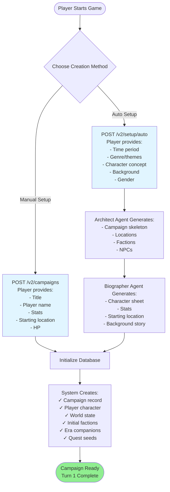
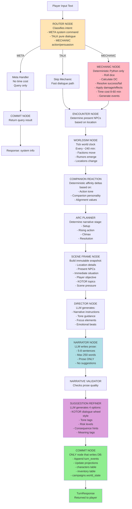
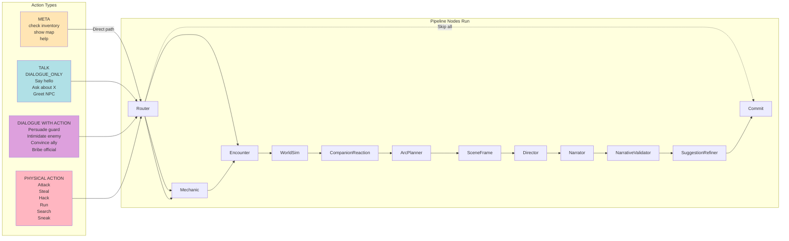
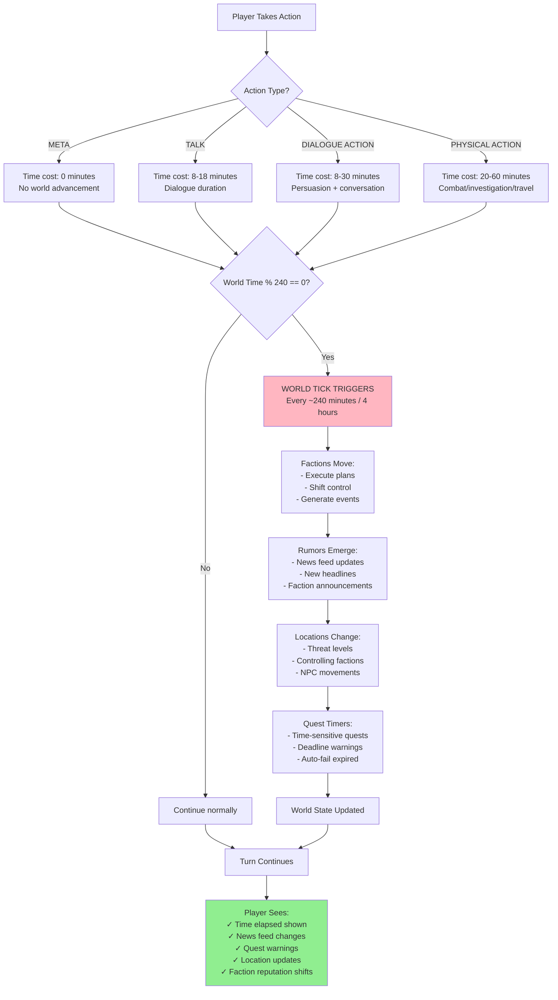
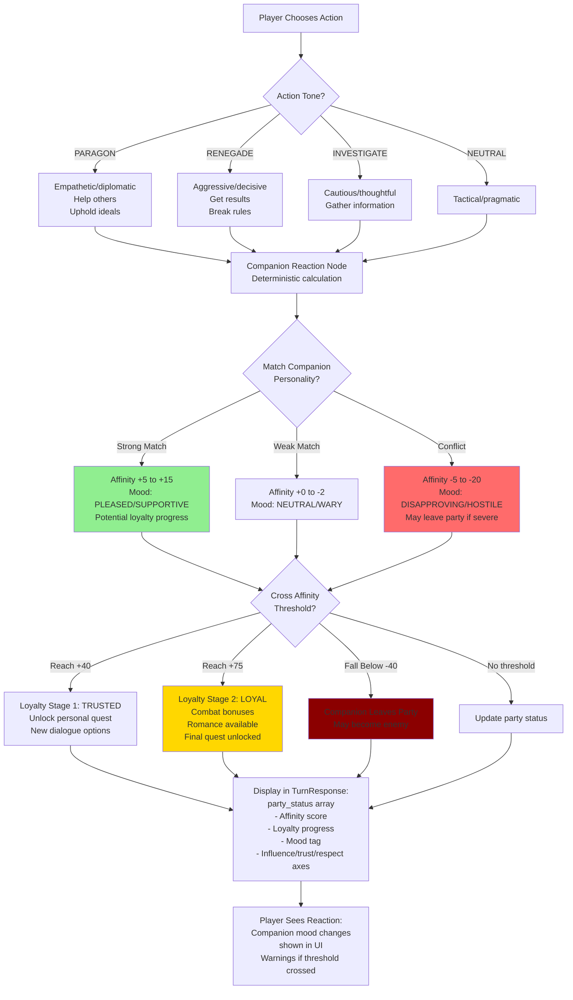
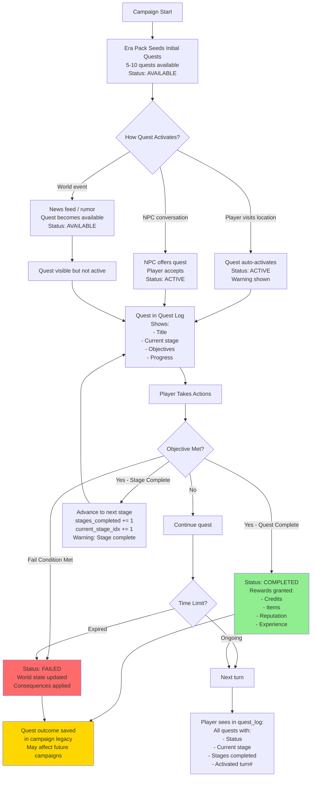
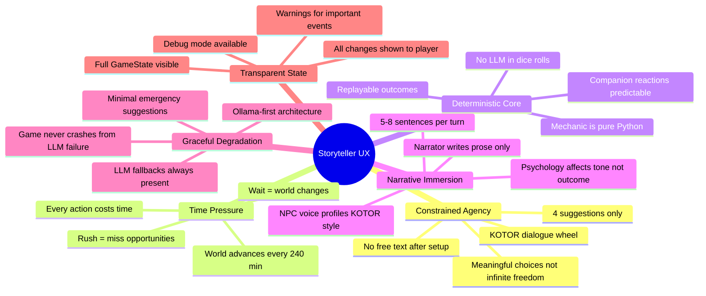

# Player User Experience Flow Diagram

## Overview

This document visualizes the complete player journey through Storyteller AI, from campaign creation to turn-by-turn gameplay.

---

## 1. Campaign Creation Flow



---

## 2. Main Gameplay Loop (Turn-by-Turn)

```mermaid
flowchart TD
    PlayerReady([Player Views Game State]) --> ViewState[GET /campaigns/{id}/state<br/><br/>Player sees:<br/>- Character sheet HP/stats/credits<br/>- Current location<br/>- Inventory<br/>- Companion status<br/>- Quest log<br/>- Faction reputation<br/>- World time<br/>- News feed]

    ViewState --> LastTurn{First Turn?}
    LastTurn --> | No| ShowNarrative[Display Previous Turn:<br/>- Narrative prose 5-8 sentences<br/>- 4 KOTOR-style suggestions<br/>- NPC dialogue if present<br/>- Quest/companion updates]
    LastTurn --> | Yes| ShowOpening[Show Campaign Opening]

    ShowNarrative --> PlayerChoice[Player Selects Action<br/>from 4 Suggestions:<br/><br/>Each shows:<br/>- Label text<br/>- Tone PARAGON/RENEGADE/INVESTIGATE/NEUTRAL<br/>- Risk level SAFE/RISKY/DANGEROUS<br/>- Consequence hint]
    ShowOpening --> PlayerChoice

    PlayerChoice --> SubmitTurn[POST /campaigns/{id}/turn<br/>Body: user_input text]

    SubmitTurn --> Pipeline[Pipeline Processing<br/>See detailed flow below]

    Pipeline --> Response[TurnResponse Received:<br/>✓ narrated_text<br/>✓ suggested_actions 4<br/>✓ player_sheet updated<br/>✓ inventory changed<br/>✓ quest_log updated<br/>✓ world_time_minutes<br/>✓ party_status<br/>✓ faction_reputation<br/>✓ news_feed<br/>✓ dialogue_turn if NPC present<br/>✓ warnings]

    Response --> UpdateUI[UI Updates All State:<br/>- Show new narrative<br/>- Display 4 new suggestions<br/>- Update character sheet<br/>- Show companion reactions<br/>- Display quest changes<br/>- Show time passed<br/>- Render NPC dialogue wheel]

    UpdateUI --> NextTurn{Continue?}
    NextTurn --> | Yes| ViewState
    NextTurn --> | No| EndCampaign[POST /campaigns/{id}/complete<br/>Save legacy & outcome]

    EndCampaign --> GameOver([Campaign Complete])

    style PlayerChoice fill:#FFD700
    style Response fill:#90EE90
    style GameOver fill:#FF6B6B
```

---

## 3. Pipeline Processing Detail (Inside Each Turn)



---

## 4. Action Type Routing & Pipeline Paths



**Pipeline Path Summary:**

- **META**: Router → Commit (instant, 0 time cost)
- **TALK**: Router → Encounter → WorldSim → CompanionReaction → ArcPlanner → SceneFrame → Director → Narrator → Validator → SuggestionRefiner → Commit (~8-18 min)
- **DIALOGUE_WITH_ACTION**: Router → **Mechanic** → Encounter → ... → Commit (8-30 min, with roll)
- **PHYSICAL_ACTION**: Router → **Mechanic** → Encounter → ... → Commit (20-60 min, with roll)

---

## 5. What Player Sees Each Turn

```mermaid
flowchart TB
    Turn[Turn Response Arrives] --> Narrative[Narrative Prose<br/>5-8 sentences<br/>250 words max<br/>Written by Narrator LLM]

    Turn --> Suggestions[4 Action Suggestions<br/>KOTOR Dialogue Wheel Style]

    Suggestions --> S1[Option 1: PARAGON<br/>Tone: Blue<br/>Risk: SAFE<br/>Help/diplomacy/empathy]
    Suggestions --> S2[Option 2: INVESTIGATE<br/>Tone: Gold<br/>Risk: SAFE<br/>Observe/ask/learn]
    Suggestions --> S3[Option 3: RENEGADE<br/>Tone: Red<br/>Risk: RISKY<br/>Aggressive/decisive]
    Suggestions --> S4[Option 4: NEUTRAL<br/>Tone: Gray<br/>Risk: Varies<br/>Tactical/action]

    Turn --> State[Updated Game State]

    State --> Char[Character Sheet<br/>- HP current/max<br/>- Stats<br/>- Credits<br/>- Location<br/>- Stress level<br/>- Mood]

    State --> Inv[Inventory<br/>- Items & quantities<br/>- Equipment<br/>- Key items]

    State --> Party[Party Status<br/>Per companion:<br/>- Affinity -100 to +100<br/>- Loyalty stage<br/>- Mood tag<br/>- Influence/trust/respect/fear]

    State --> Quests[Quest Log<br/>- Active quests<br/>- Current stage<br/>- Objectives<br/>- Status]

    State --> World[World State<br/>- Time elapsed minutes<br/>- Faction reputations<br/>- News feed headlines<br/>- Active rumors]

    Turn --> Dialogue{NPC Present?}
    Dialogue --> | Yes| NPCWheel[NPC Dialogue Wheel<br/>- Scene frame context<br/>- NPC utterance<br/>- 4 response options<br/>- Voice profile<br/>- Topics belief/wound/taboo]
    Dialogue --> | No| Continue[Action suggestions only]

    Turn --> Warnings[Warnings Array<br/>- Quest updates<br/>- Companion reactions<br/>- World events<br/>- System messages]

    style Narrative fill:#B0E0E6
    style S1 fill:#87CEEB
    style S2 fill:#FFD700
    style S3 fill:#FF6B6B
    style S4 fill:#D3D3D3
    style NPCWheel fill:#DDA0DD
```



---

## 6. Time & World Progression



**Key Insight:** Time pressure creates meaningful choices:

- **Rush through actions** = cover more ground, but miss clues and opportunities
- **Take time to investigate** = gather intel, but world advances without you

---

## 7. Companion Reaction System



**Companion Personality Examples:**

- **Idealist** (e.g., Jedi Knight): Approves PARAGON, disapproves RENEGADE
- **Pragmatist** (e.g., Smuggler): Approves tactical NEUTRAL, tolerates RENEGADE
- **Rebel** (e.g., Freedom Fighter): Approves defiance, disapproves submission
- **Cynic** (e.g., Bounty Hunter): Approves RENEGADE efficiency, mocks PARAGON idealism

---

## 8. Quest & Objective Flow



**Quest Stage Example:**

```json
{
  "quest-rescue-pilot": {
    "status": "active",
    "current_stage_idx": 2,
    "stages_completed": 1,
    "stages": [
      {"description": "Find the crash site", "completed": true},
      {"description": "Locate the pilot", "completed": true},
      {"description": "Escort pilot to safety", "completed": false},
      {"description": "Report to command", "completed": false}
    ]
  }
}
```

---

## 9. Key UX Principles



---

## 10. Complete Player Journey Summary

```mermaid
flowchart TB
    subgraph "Phase 1: Setup 5 min"
        P1Start([Player Opens Game]) --> P1Create[Create Campaign<br/>Auto or Manual]
        P1Create --> P1Ready[Campaign Ready<br/>Character Sheet Generated]
    end

    subgraph "Phase 2: Early Game Turns 1-20"
        P2Start[View Opening State] --> P2Explore[Explore starting location<br/>Talk to NPCs<br/>Accept first quest]
        P2Explore --> P2Companions[Recruit 1-2 companions<br/>Learn personalities]
        P2Companions --> P2Tutorial[Learn action types<br/>PARAGON vs RENEGADE<br/>Time management]
    end

    subgraph "Phase 3: Mid Game Turns 20-100"
        P3Quests[Progress multiple quests<br/>Navigate faction conflicts<br/>Build companion loyalty]
        P3Quests --> P3World[World ticks advance<br/>News feed updates<br/>Faction territories shift]
        P3World --> P3Choices[Make alignment choices<br/>LIGHT/DARK<br/>PARAGON/RENEGADE]
        P3Choices --> P3Companion[Companion loyalty missions<br/>Romance options<br/>Personal story arcs]
    end

    subgraph "Phase 4: Late Game Turns 100+"
        P4Climax[Narrative arc climax<br/>Major faction conflicts<br/>High-stakes quests]
        P4Climax --> P4Resolution[Campaign resolution<br/>Companion fates decided<br/>Faction outcomes]
        P4Resolution --> P4Complete[Complete campaign<br/>Save legacy]
    end

    P1Ready --> P2Start
    P2Tutorial --> P3Quests
    P3Companion --> P4Climax
    P4Complete --> P5[Legacy Saved<br/>Start New Campaign]

    style P1Ready fill:#90EE90
    style P3Companion fill:#FFD700
    style P4Complete fill:#FF6B6B
    style P5 fill:#DDA0DD
```



**Average Session Lengths:**

- **Short session:** 5-10 turns, 15-30 minutes real time
- **Medium session:** 20-40 turns, 1-2 hours real time
- **Long campaign:** 100-300 turns, 10-30 hours total playtime

---

## API Endpoint Quick Reference

| Endpoint | Method | Purpose | When Player Uses |
| ---------- | -------- | --------- | ------------------ |
| `/v2/setup/auto` | POST | Auto-generate campaign | First time setup |
| `/v2/campaigns` | POST | Manual campaign creation | First time setup (advanced) |
| `/v2/campaigns/{id}/state` | GET | Fetch full game state | Every session start |
| `/v2/campaigns/{id}/turn` | POST | Execute one turn | Every player action |
| `/v2/campaigns/{id}/turn_stream` | GET | Stream turn with SSE | Real-time narrative mode |
| `/v2/campaigns/{id}/transcript` | GET | View past turns | Review history |
| `/v2/campaigns/{id}/world_state` | GET | Get world flags/factions | Debug/inspect world |
| `/v2/campaigns/{id}/locations` | GET | View location map | Travel planning |
| `/v2/campaigns/{id}/rumors` | GET | Get recent rumors | Intelligence gathering |
| `/v2/campaigns/{id}/complete` | POST | End campaign & save legacy | Campaign finished |
| `/v2/era/{era}/backgrounds` | GET | List character backgrounds | Character creation |
| `/v2/era/{era}/companions` | GET | Preview companions | Party planning |
| `/v2/player/profiles` | GET | List player profiles | Cross-campaign tracking |

---

## Glossary of Player-Facing Terms

**Turn:** One complete action cycle (player input → pipeline → narrative response)

**KOTOR Wheel:** 4-option dialogue system inspired by Knights of the Old Republic, color-coded by tone

**Affinity:** Companion relationship score (-100 to +100)

**Loyalty Stage:** Companion trust level (0=Stranger, 1=Trusted, 2=Loyal)

**World Tick:** Automatic world advancement every ~240 minutes (factions move, rumors emerge)

**Action Type:** Classification of player input (META, TALK, DIALOGUE_WITH_ACTION, PHYSICAL_ACTION)

**Risk Level:** Difficulty indicator (SAFE, RISKY, DANGEROUS) affecting DC rolls

**Tone:** Action alignment (PARAGON=blue, RENEGADE=red, INVESTIGATE=gold, NEUTRAL=gray)

**Time Cost:** Minutes of world time consumed by action (0 for META, 8-60 for others)

**Scene Frame:** Immutable snapshot of current situation (location, NPCs, objectives, topics)

**Mechanic:** Deterministic dice roll and rules resolution (no LLM)

**Narrator:** LLM agent that writes 5-8 sentence prose descriptions

**Suggestion Refiner:** LLM agent that generates 4 KOTOR-style action options

**Era Pack:** Curated content bundle for a Star Wars time period (locations, NPCs, quests, companions)

**Legacy:** Saved campaign outcome that influences future playthroughs

**Projection:** Derived database table (characters, inventory) built from event log

---

## This Diagram's Purpose

This flow diagram is designed to help:

- **Players** understand what the system does turn-by-turn
- **Developers** see the player-facing experience separate from internal pipeline
- **Designers** identify UX touchpoints and state visibility
- **QA** test the complete player journey end-to-end

For internal pipeline architecture details, see `/docs/architecture.md`.
For API contracts and field definitions, see `/API_REFERENCE.md`.
For deep technical docs, see `/docs/00-09` numbered series.
